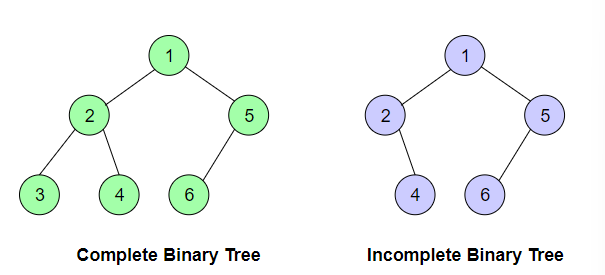

## Trees

### Binary Search Tree

#### Delete

##### Time Complexity

- In a balanced tree, we are always cutting the tree in half in our search, so it's O(log n)
  - **A balanced binary tree (aka a height-balanced binary tree) is defined as a binary tree in 
    which the height of the left and right subtree of any node differ by not more than 1**
- If we have a fully skewed tree, worst case is O(n)

#### Pre-Order Traversal

- Elements are traversed in "root-left-right" order
- **First** we visit the *root*
- **Second** we visit the *left* node
- **Third** we visit the *right* node

##### Time Complexity

- O(n)

#### In-Order Traversal

- Elements are traversed in "left-root-right" order
- **First** we visit the *left* node
- **Second** we visit the *root* node
- **Third** we visit the **right** node

##### Time Complexity

- Note this visits nodes in a non-decreasing way
  - Not just increasing here because you could have nodes of the same value between root and left child
- O(n) because we have to visit all the nodes exactly once

#### Post-Order Traversal

- Elements are traversed in a "left-right-root" order
- **First** we visit the *left* child
- **Second** we visit the *right* child
- **Third** we visit the *root*

##### Time Complexity

- O(n)

## Graphs

### Intro

- See `data-structures/graphs.drawio` for some intro information

### Representation of Graphs

#### Ways to Represent a Graph

- Most common ways to represent a graph are:
  - Adjacency Matrix
  - Adjacency List

##### Adjacency Matrix

- Two-dimensional matrix where each cell can contain either a `0` or a `1`
- The row and column heads represent the vertices

- Initially, the whole matrix is initialized with `0's`, and as soon as we get an edge, we record the source(row) and destination (col) inside our adjacency matrix

**Undirected Graph**
- In the figure above, there is an *undirected graph*
- If there exists an edge from the source to destination we insert **1** for both cases `matrix[row][col]` and `matrix[col][row]` *because we can traverse both ways*

**Directed Graph**
- In the case of a directed graph (which has an edge going from Node 0 to Node 1), there is **1** for `matrix[0][1]` in the *adjacency matrix*
- If there is a node going from `[row]` to `[col]`, then we insert **1** for that at `matrix[row][col]` otherwise we put **0**

##### Adjacency List

- An array of LinkedLists is used to store edges between two vertices
- The size of the array is equal to the number of vertices
- Each index in the array represents a specific vertex in the graph
- The entry at index `i` of the array contains a linked list containing the vertices that are adjacent to vertex `i`

###### Undirected Graph

- For the undirected graph shown below, each `edge` connected to a vertex is mentioned in the `linked list` of the array index (representing that vertex)
- Since there is an `edge` from *vertex 0* to *vertex 1*, so the `linked list` of vertex 0 (at array index 0) has a node with value 1
  - This represents that vertex 1 is having an edge with vertex 0

- A significant point to note here is that since this is an undirected graph, a `linked list` at vertex 1 will also contain a `node` with value 0, representing a edge from 1 to 0

###### Directed Graph

- For the directed graph shown below, there are two outgoing `edges` from vertex 0
  - First to vertex 1
  - Second to vertex 2
- `Linked list` at array index 0 has `nodes` with value 1 and 2

- Since this is a directed graph and `edges` are unidirectional, there exists no `edge` between vertex 1 and vertex 0 or vertex 2 and vertex 0
- So 0 does not exist in the `linked list` of vertex 1 or vertex 2

### Space Complexity

- O(V^2) in worst case - when every node is connected to all other nodes
  - 0 -> [1, 2, 3]
  - 1 -> [0, 2, 3]
  - 2 -> [0, 1, 3]
  - 3 -> [0, 1, 2]
- Every vertex has (v - 1) entries so all our our verties * (v - 1) ~= v^2
- Note this is actually still the same as O(V + E) in this scenario

### Time Complexity

- In time complexities below *V* = total number of vertices, *E* = total number of edges
- **Add Vertex**
  - Adjacency List: O(1)
    - Amortized time on average O(1)
  - Adjacency Matrix: O(V^2)
- **Remove Vertex**
  - Adjacency List: O(V + E)
  - Adjacency Matrix: O(V^2)
- **Add Edge**
  - Adjacency List: O(1)
  - Adjacency Matrix: O(1)
- **Remove Edge**
  - Adjacency List: O(E)
  - Adjacency Matrix: O(1)

#### Adjacency List

- Addition of an edge in takes constant time, as we only need to insert at the tail in the DLL w/ a tail pointer of corresponding vertex
  - `this.adjacencyList[source].addLast(destination);`
- Removing an edge takes O(E) b/c - in the worst case - all edges could be at a single vertex, so we would have to traverse all edges to reach the last one
- Removing a vertex takes O(V + E) because we have to delete all its edges, and then reindex the rest of the list one step back in order to fill the deleted spot

#### Adjacency Matrix
- Edge operations are performed in constant time, as we only need to manipulate the values in a particular cell
- Vertex operations are performed in O(V^2) since we need to add rows/columns
  - We will also need to fill all the new cells

#### Comparison

- If your model frequently manipulates vertices, the adjacency list is a better choice
- If you are dealing primarily with edges, the adjacency matrix is the more efficient choice

### Types of Graph Traversals

- Two basic techniques
  - BFS (Breadth First Search)
  - DFS (Depth First Search)
- Traversals need a starting point, but a graph does not have a linear structure like lists or stacks - so how do we give the graph traversal a better sense of direction
- This is where the concept of **levels** is helpful
- Take any vertex as the starting point, this is the lowest **level** in your search
- The **next level** consists of all the vertices adjacent to your vertex
  - The next/higher level would consist of the vertices adjacent to these nodes

#### Breadth First Search (BFS)

- *All nodes are at a level are traversed before moving onto the next level*
- Start traversing from any vertex
  - If adjacent vertices are not already visited, then visit them (could simply be just printing their values)
  - Then move on to the children of the starting vertex

#### Depth First Traversal (DFS)

- Opposite of BFS in the sense that we go deep before going wide
- Starting from any node, we keep moving to an adjacent node until we reach the farthest level
- Then we move back to the starting point and pick another adjacent node

#### Time Complexity

- BFS
  - Adjacency List
    - O(V + E)
      - Have to visit every vertex and every edge
  - Adjacency Matrix
    - O(V^2)
- DFS
  - Adjacency List
    - O(V + E)
  - Adjacency Matrix
    - O(V^2)

## Heaps

### Introduction

- Data structure based on Binary Trees
- Commonly referred to as *Binary Heaps*
- *A Binary Heap is a complete Binary Tree which satisfies the Heap ordering property*
- Heaps are implemented through Arrays
  - Each element of the array corresponds to a node in the binary tree
  - The value inside the node is called a *key*
- Heaps *can* be implemented through trees with a node class and pointers but it's usually easier and more space efficient to use an array
- All nodes are ordered according to the rules listed below
  - *A Heap tree must be a complete Binary Tree*
  - *The nodes must be ordered according to the Heap Property*

**Common Misconception**

- There is a common misconception that the elements of a Heap are sorted
- They are not at all sorted; in fact, the only key feature of a Heap is that the largest or smallest element is always placed at the top
  - Smallest for minHeap, largest for maxHeap

### Rule 1: Complete Binary Tree

- A Complete Binary Tree is a tree where each node has a max of two children and all nodes at all levels are completely filled (except the *leaf nodes*)
- Nodes at the last level must be structured in such a way that the left side is never empty
- A Heap uses *Complete Binary Trees* to avoid holes in the array
- If Node A has a child Node B: `key(A) >= key(B)`

### Rule 2: Heap Property

- A heap is built by comparing the parent node with its child node keys
- Two core heap structures
  - Min Heap
  - Max Heap

#### Rule 2.1: Max Heap Property

- This property states that all the parent node keys must be greater than or equal to their child node keys
- So the root node will always contain the largest element present in the Heap

#### Rule 2.2: Min Heap Property

- This property states that all the parent node keys are less than or equal to their child node keys
- Root node will always contain the smallest element present in the Heap
- If Node has a child Node B: `key(A) <= key(B)`

### Why Use Heaps?

- **Order statistics**
  - Heaps are primarily used for efficiently finding the smallest or largest element in an array
- **Priority Queues**
  - Priority queues can be efficiently implemented using Binary Heap b/c it supports `insert()`, `delete()`, `extractMax()`, and `decreaseKey()` operations in *O(log(n))* time 
- **Sorting**
  - `HeapSort` uses the Heap data structure to sort values in the exact same way as `TreeSort` uses a Binary Search Tree
  - Each `insert()` and `delete()` operation is `O(log(N))`

### Heap Representation in Arrays

- Heaps can be implemented using arrays
- The contents of a heap with `n` nodes are stored in such a way that all the parent nodes occur in the first half of the array `n/2`, while the leaves are present in the last `n/2` positions
- Last parent node will be at the `n/2`th node
- Given a node at the *kth* position, its children wil be placed at:
  - The left child at *2k + 1*
  - The right child at *2k + 2*

