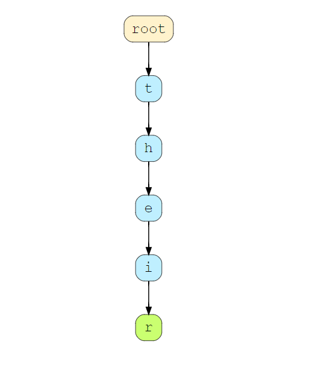
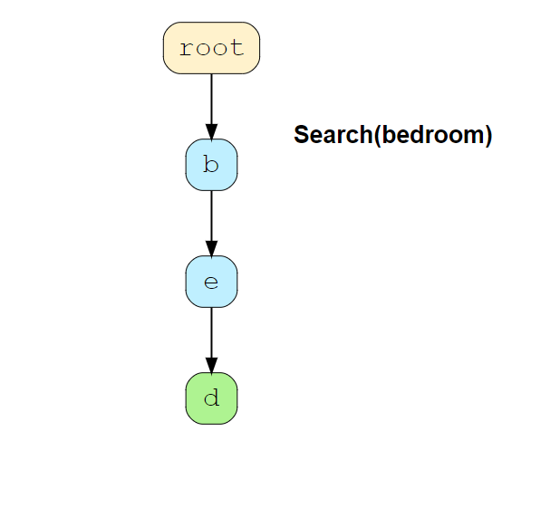

# Trie

## Introduction

- Solves programming problems related to `Strings` efficiently
- `Trie` comes from the word **retrieval**
- Main purpose of this data structure is to provide fast retrieval
- *Tries are mostly used for searching words in dictionary, providing auto-suggestions in search engines, and IP routing*

## Common Applications of Tries

- Used where fast retrieval is required

### Auto-Complete Words

- Can be efficiently implemented using `Tries`

### Spell-Checking

- Used to check if the word already exists in a **dictionary** or if the user needs to be corrected
- Really helpful when the user does not know the exact spelling of a keyword he's searching for

### Searching for a Contact in a Phone

- `Tries` are commonly used to do this

## Properties of Trie

- **Tries** are similar to Graphs, as they are a combination of nodes where each node represents a unique alphabet
- **Tries** are more like ordered trees where each of the children be be either Null or points to a node
- The size of the **Trie** depends upon the letters
  - In English, there are 26 letters
- Depth of a **Trie** depends on the **longest word** that it stores
- **Tries** provide the same path for words that share a common prefix
  - **There** and **their** share the prefix **the** so they will share the same path until **e**

## Structure of a Trie

- A `node` in a `Trie` represents a latter in an alphabet
- If we want to insert **hello**, we will need to add 5 nodes

## Insertion in a Trie

### Case 1: What if the word has no common subsequence (no common prefix)?

- What if we want to insert **any** into the trie above?
- We need to insert all the characters for the word **any** because there are no common character subsequences between **any** and **the**

### Case 2: If the word has a common subsequence (there is a common prefix)?

- If we want to insert the word **there** into the trie above, then the path **the** already exists
- We need to insert nodes for **e** and **r**

### Case 3: If the word is already present?

- In the above example, we already have a trie that consists of **their** (and we later added **there**)
- If we want to add **the**, we can see that it is already present, and we need to set the value of `isEndWord()` to be true at **e** is order to represent the end of the word for **the**

## Searching in a Trie

### Case 1: Word is not present in Trie

- If there is no path, as in the above example with **bedroom**, then we will only be able to trace until **bed**
- We will return false here

### Case 2: Path found but `isEndWord()` is not set for the last character

- If we are searching for word **be** but `isEndNode()` for **e** node is false (which indicates the word does not terminate at **e**), then **be** is not a valid word

### Case 3: Word is found and `isEndWord()` is set for last node of the path

- Success case where there exists a path and the last node in the path is also end-of-word

## Deletion in a Trie

### Case 1: If the word to be deleted has no common subsequence

- If the word has no common subsequence with any other words, then all the nodes of that word are deleted

- In the above example, we have to delete ALL characters in **bat** in order to delete the word **bat**

### Case 2: If the word to be deleted is a prefix of some other word

- If the word to be deleted is a prefix of some other word, then the value of `isEndWord` of the last node of that word is set to `false`
- No nodes are deleted

### Case 3: If the word to be deleted has a common prefix

- If the word to be deleted has a common prefix and the last node of that word is also the leaf node, then this node is deleted along with all the higher-up nodes in its branch that do not have any other children and whose `isEndWord` is false

- In the above example, we'll traverse the common path up to **the** and delete the characters **i** and **r** in order to delete **their**

