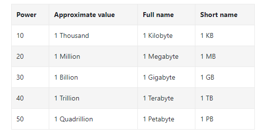
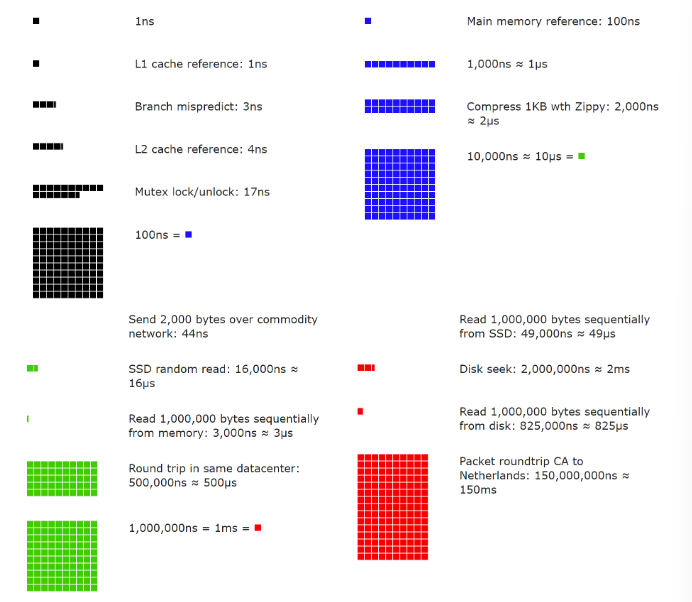
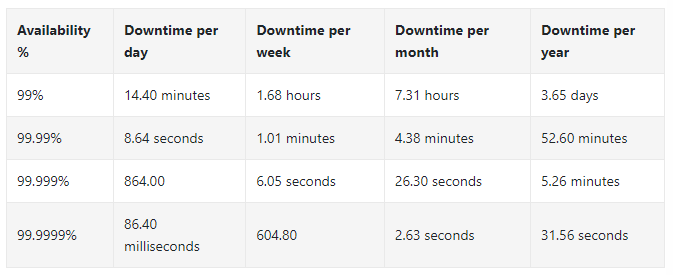

# Back-of-the-envelope Estimation

- Calculations you can create using a combination of thought experiments and common performance numbers to get a good feel for which designs will meet your requirements

## Power of two

- A byte is a sequence of 8 bits
- An ASCII character uses one byte of memory (8 bits)

## Latency numbers every programmer should know

- ns = nanosecond
  - 1 ns = 10^-9 seconds
- µs = microsecond
  - 1 µs = 10^-6 seconds
- ms = millisecond
  - 1ms = 10^-3 seconds

 

- Memory is fast but disk is slow
- Avoid disk seeks if possible
- Simple compression algorithms are fast
- Compress data before sending it over internet if possible
- Data centers are usually in different regions, and it takes time to send data between them

### Availability numbers

