# Design A Chat System

## Step 1 - Understand the problem and establish design scope

- Need to agree on the type of chat to design
- There are one-on-one chat apps, there are office chat apps (like Slack), and there are game chat apps (like Discord)

 

- A one-on-one chat with low delivery latency
- Small group chat (max of 100 people)
- Online presence (seen when someone is online)
- Multiple device support
  - Same account can be logged into multiple devices at the same time
- Push notifications
- 50 million DAU
- Text in message should be less than 100k characters

## Step 2- Propose high-level design and get buy-in

- Clients can either be mobile applications or web applications
- Clients do not communicate directly with each other
- Each client connects to a chat service, which supports the features agreed upon in the previous section
- Chat service must support following functions
  - Receive messages from other clients
  - Find the right recipients for each message and relay the message to the recipients
  - If a recipient is not online, hold the messages for that recipient on the server until she is online

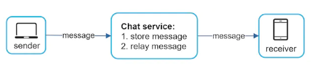

- When a client intends to start a chat, it connects to the chat service using one or more network protocols
- Could use HTTP with a keep-alive header
  - This allows a client to maintain a persistent connection with the chat service
  - Also reduces number of TCP handshakes (which take time)
- HTTP works when a client is sending message to the server, but what if the server needs to send a message to a receiver that it got from a sender?
  - Couple of options, polling, long polling, and websockets

### Polling

- Client periodically asks the server if there are messages available
- If client is asks messages too many times, could cost the server a lot of resources to answer

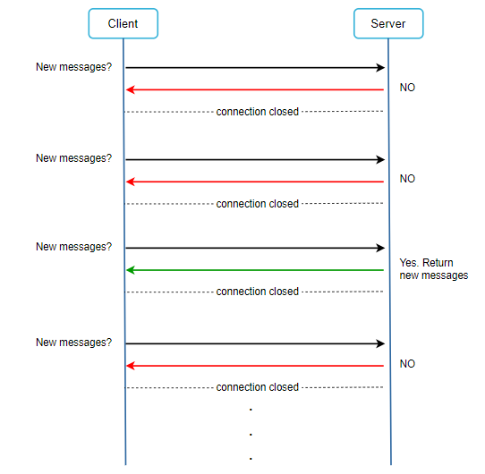

### Long Polling

- In long polling, a client holds the connection open until there are actually new messages available or a timeout threshold has been reached
- Couple of drawbacks
  - Sender and receiver may not be connected to the same chat server
  - A server has no good way to tell if a client is disconnected
  - It is inefficient - if a user does not chat much, long polling still makes periodic connections after timeouts

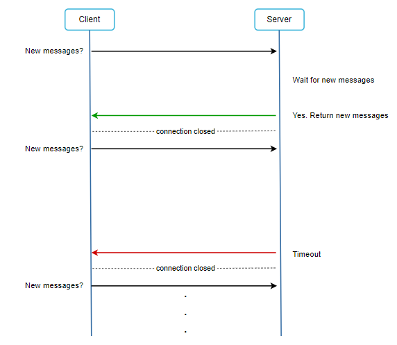

### WebSocket

- WebSocket is the common solution for sending async updates from server to client
- A WebSocket connection is initiated by the client
- It is bi-directional and persistent
- A websocket connection starts its life as a HTTP connection and could be "upgraded" via some well-defined handshake to become a websocket connection
- This allows a server to send updates to a client

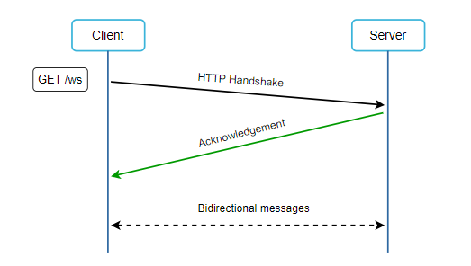

- By using websockets for both sending and receiving, it simplifies the design and makes implementation on both client and server more straightforward
- Since websocket connections are persistent, efficient connection management is important on the server-side

## High-level Design

- Most features can use standard http
- The chat system is broken down into 3 major categories
  - Stateless services
  - Stateful services
  - 3rd party integration

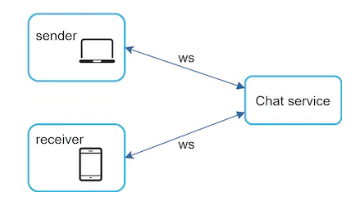

### Stateless Services

- Traditional public-facing request/response services used to manage login, signup, user profile, etc
- Sit behind LB
- One interesting service here is the `service discovery` - this will be critical b/c its primary job is to give a client a list of DNS host names of chat servers that it can connect to

### Stateful Service

- The only stateful service is the chat service
- Each client maintains a persistent network connection to a chat server
- The service discovery will coordinate closely with the chat server to avoid server overloading

### Third-party integration

- For a chat app, push notification is a common and important third-party integration
- It is a way to inform users when new messages have arrived, even wen the app is not running

### Scalability

- On a small scale, all services could fit into one server
- In our scenario, at 1M concurrent users, assuming each user connection needs 10K of memory on the server (rough figure and dependent on language choice), it only needs about 10GB of memory to hold all the connections on one box
- Event though this means technically we *could* fit on one server, this isn't a good design for many different reasons including this becomes a single point of failure
  - However, this is fine as a starting point

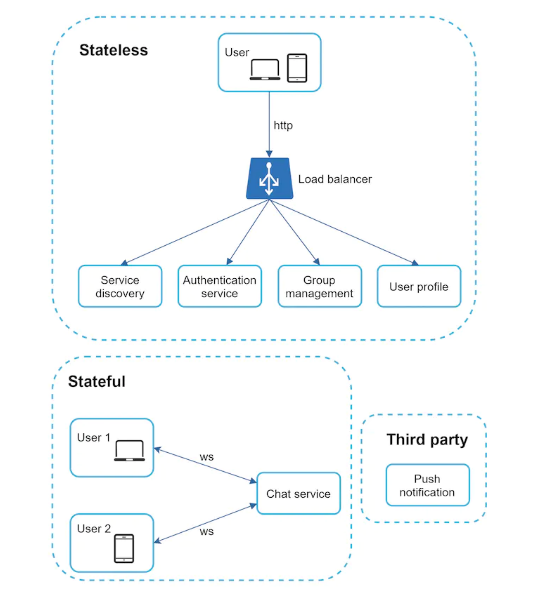

- In the above diagram:
  - Chat servers facilitate message sending/receiving
  - Presence servers manage online/offline status
  - API servers handle everything including user login, signup, change profile, etc
  - Notification servers send push notifications
  - Key-value store is used to store chat history
  - When a offline user comes online, she will see all her previous chat history

### Storage

- An important decision we must make is to use a relational db or nosql db
- To decide how to do this, need to understand the data types and read/write patterns
- Two types of data exist in a typical chat system
- First is generic data like user profile, settings, user's friends list, etc
  - It makes sense to store this in a relational db
  - Replication and sharding are common techniques to satisfy availability and scalability requirements
- Second is unique to chat systems: chat history data
  - Amount of data is enormous for chat systems
    - 60B millions through Whatsapp per day
  - Only recent messages are accessed frequently
  - Users might use features that require random access of data (like search)
  - Read to write ratio is about 1:1 for 1 on 1 chat apps
- KV store recommended for this data
  - Key-value stores allow easy horizontal scaling
  - Key-value stores provide very low latency to access data
  - Relational DBs do not handle long tail of data well
    - When indexes grow large, random access is expensive
  - KV stores are used in existing chat applications

## Storage

### Message table for 1 on 1 chat

- Primary key is *message_id* which helps to decide message sequence
- Cannot rely on *created_at* to decide message sequence because two messages can be created at the same time

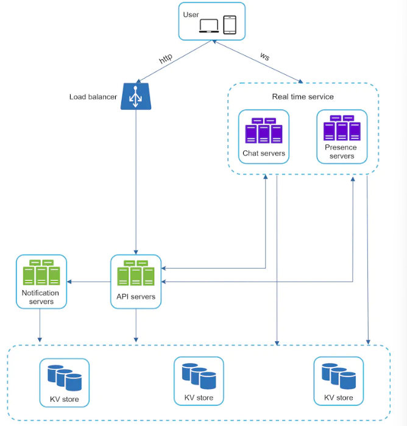

### Message table for group chat

- Composite primary key is *(channel_id, message_id)*
  - Channel and group represent the same meaning here
- *channel_id* is the partition key because all queries in a group chat operate in a channel

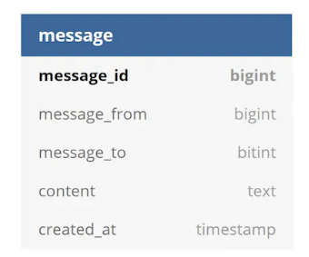

### Message ID

- *message_id* is responsible for ensuring ordering of messages
- *message_id* must satisfy two requirements
  - IDs must be unique
  - IDs should be sortable by time, meaning new rows have higher IDs than old ones
- Could use a global 64-bit sequence generator like Snowflake
- Could use a local sequence number generator
  - Local here means IDs that are only unique within a group

## Step 3 - Design dep drive

- For a chat system, service discovery, messaging flows, and online/offline indicators are worth deeper exploration

### Service discovery

- Primary job is to recommend the best chat server for a client based on criteria like geographical location, server capacity, etc
- Apache Zookeeper is a popular open-source solution for service discovery

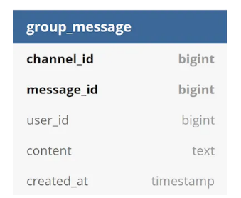

- User A logins to app
- LB sends login request to API
- Backend authenticates user
- Service discovery finds the best chat server for user A
  - Chat server 2 chosen here
- User A connects to server 2 through WebSocket

### Message Flows

#### 1 on 1 Chat fow

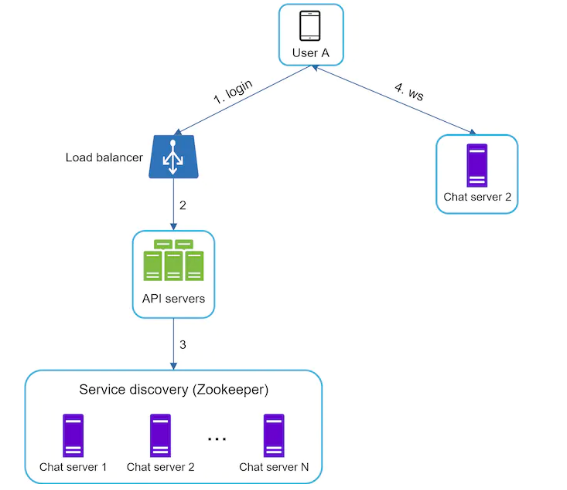

- User A sends a chat message to Chat server 1
- Chat server 1 obtains a message ID from the ID generator
- Chat server 1 sends the message to the message sync queue
- The message is stored in a key-value store
- If User B is online, a message is forwarded to Chat server 2 where User B is connected
  - If User B is offline, a push notification is sent from push notification servers
- Chat server 2 forwards the message to User B
  - There is a persistent WebSocket connection between User B and Chat server 2

#### Message sync across multiple devices

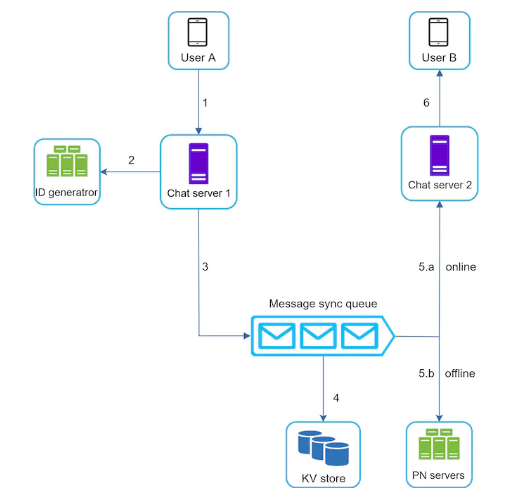

- In above figure, User A has two devices: phone and laptop
- When User A logs in to the chat app with her phone, it establishes a WebSocket connection with Chat server 1
  - Similarly, there is a connection between the laptop and Chat server 1
- Each device maintains a *curr_max_message_id* which keeps track of the latest message ID on teh device
- Messages that satisfy the following two conditions are considered as new messages
  - The recipient ID is equal to the currently logged in user ID
  - Message ID in the key-value store is larger than *cur_max_message_id*
- With a distinct *cur_max_message_id* on each device, message synchronization is easy as each device can get new messages from the KV store

#### Small group chat flow

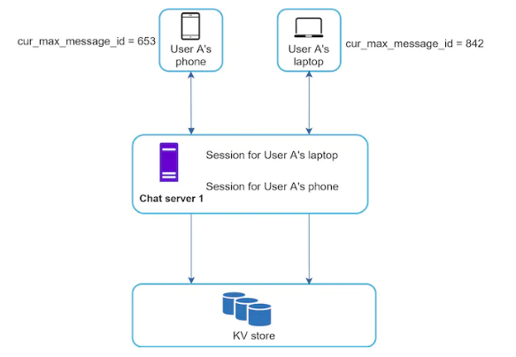

- Assume that there are 3 members in the group
- Message from User A is copied to each group member's message sync queue
  - One for User B
  - One for User C
- Message sync queue can be thought of as an inbox for a recipient
- This design is good for small group chat because
  - It simplifies message sync flow as each client only needs to check its own inbox to get new messages
  - When the group is small, storing a copy in each recipient's inbox is not too expensive

 

- On the recipient side, a recipient can receive messages from multiple users
- Each recipient has an inbox (message sync queue) which contains messages from different senders

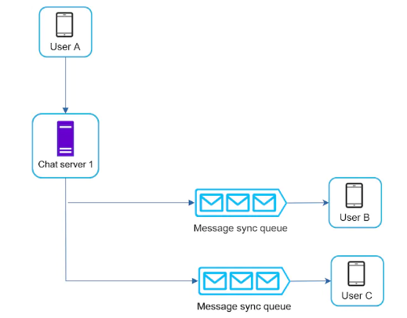

## Online Presence

- An online presence indicator is an essential feature of many chat apps
- In the high-level design, presence servers are responsible for managing online status and communicating with clients through WebSocket

### User login

- The user login flow is explained in the "Service Discovery" section
- After a websocket connection is built between the client and the real-time service, User A's status and *last_active_at* timestamp are saved in the KV store
- Presence indicator shows the user is online after he/she logs in 

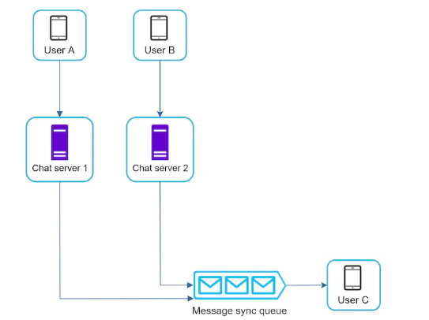

### User logout

- When a user logs out, it goes through the below flow
- The online status is changed to offline in the KV store
- Presence indicator shows a user is offline

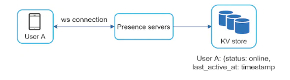

### User disconnection

- When a user disconnects from the internet, the persistent connection between client and server is lost
- A naive way to handle user disconnection is to mark the user as offline and change the status to online when the connection re-establishes
- This approach has a major flow
  - It is common for users to disconnect and reconnect to the internet frequently in a short time
  - This could result in a poor user experience
- You can use a heartbeat mechanism to solve this problem
  - Periodically, an online client sends a heartbeat event to presence servers
    - If presence servers receive a heartbeat even within x seconds, user is online, otherwise offline

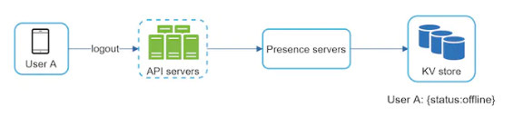

### Online status fanout

- How does User A's friends know about status changes?
- Presence servers use a pub-sub model, in which each friend pair maintains a channel
- When User A's online status changes, it publishes the event to three channels
  - A-B
  - A-C
  - A-D

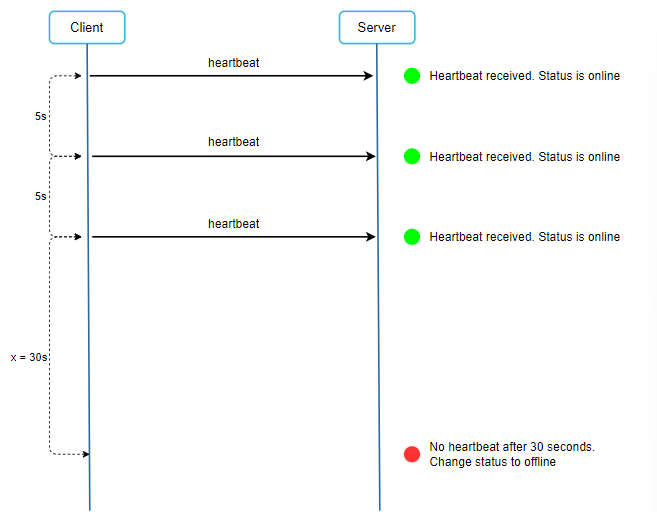

- This works for a small user group
- For larger groups, informing all members about online status is expensive and time-consuming 
  - In this case, a possible solution is to fetch online status only when a user enters a group or manually refreshes a friend list