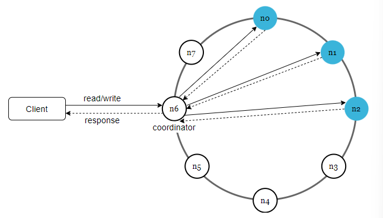

# Design A Key-Value Store

- A key-value-store, aka key-value db, is a non-relational db
- Key must be unique
- Key can be plain text or hashed values
In this chapter you are asked to design a key-value store that supports the following operations
  - `put(key, value)` //insert *value* associated with *key*
  - `get(key)` //get *value* associatd with *key*

## Understand the problem and establish design scope

- Design a key-value store with following characteristics
- Size of key-value pair is small: less than 10KB
- Ability to store big data
- High availability: system responds quickly, even during failures
- High scalability: system can be scaled to support large data set
- Automatic scaling: Addition/deletion of servers should be automatic based on traffic
- Tunable consistency
- Low latency

## Single server key-value store

- Intuitive approach is to store key-value pairs in hash table and keep everything in memory
- Two optimizations that can be done here is
  - data compression
  - store frequently used data in memory and the rest on disk
- This doesn't scale - single server can reach capacity very quickly

## Distributed key-value store

- This is needed to support big data
- This is also called a distributed hash table
- Important to understand CAP theorem when designing a distributed system

### CAP Theorem

- Impossible for a distributed system to simultaneously provide more than two of these three guarantees: *consistency*, *availability*, and *partition tolerance*
- **Consistency**
  - All clients see all the same data at the same time no matter which node they are connected to
- **Availability**
  - Any client which requests data gets a response even if some nodes are down
- **Partition Tolerance**
  - A partition indicates a communication breakdown between two nodes
  - Partition tolerance means the system continues to operate despite network partitions
- CAP theorem says you only get 2 out of the 3 of these
- **CP (consistency and partition tolerance) systems**
  - A CP key-value store supports consistency and partition tolerance while sacrificing availability
- **AP (availability and partition tolerance) systems**
  - An AP key-value store supports availability and partition tolerance while sacrificing consistency
- **CA (consistency and availability) systems**
  - This doesn't exist in real world

**Real-world distributed systems**

- When a partition occurs, we must choose between consistency and availability
- If we choose consistency over availability (CP), we must block all write operations to nodes until n3 comes back up to avoid data inconsistency among 3 servers
- Bank systems are usually required to be strongly consistent
- If we choose AP, systems can keep accepting reads even though stale data might be returned
- For writes, nodes still up will keep accepting writes, data to down node will be synced when back online

## System components

- Core components and techniques used to build a key-value store
- Data partition
- Data replication
- Consistency
- Inconsistency resolution
- Handling failures
- System architecture diagram
- Write path
- Read path

## Data Partition

- Need to split data into smaller pieces/partitions and store them on multiple servers
- Two challenges
  - Distribute data across multiple servers evenly
  - Minimize data movement when nodes are added or removed
- Consistent hashing is used to solve these problems

## Data Replication

- To achieve high availability and reliability, data must be replicated asynchronously *N* servers, where *N* is a configurable parameter
- *N* servers are chosen using following logic
  - After key is mapped to a position on the hash ring, walk clockwise from position and choose first *N* servers on the ring to store copies

- With vNodes, the first *N* nodes on the ring may be owned by fewer than *N* physical servers
- To avoid this issues, only choose unique servers

## Consistency

- Since data is replicated across multiple nodes, it must be synchronized across replicas
- *Quorum consensus* can guarantee consistency for both read and write operations
  - *N* = number of replicas
  - *W* = write quorum of size *W*
    - For a write operation to be considered successful, write operation must be acknowledged by *W* replicas
  - *R* = A read quorum of size *R*
    - For a read operation to be considered successful, read operation must wait for responses from at least *R* replicas

- Consider above where *N* = 3
- *W* = 1 means that the coordinator must receive at least one ack before the write operation is considered successful
- A *coordinator* acts as a proxy between the client and the other nodes
- The configuration of *W*, *R*, and *N* is a typical tradeoff between latency and consistency
- If `W = 1` or `R = 1`, operation is returned quickly because a coordinator only needs to wait for a response from any of the replicas
- If `W > 1` or `R > 1`, the system offers better consistency but the operation will be slower because the coordinator must wait for a response from the slowest replica
- If `W + R > N`, strong consistency is guaranteed because there must be at least one overlapping node that has the latest data to ensure consistency
- How to configure *N*, *W*, and *R*?
  - If `R = 1` and `W = N`, system is optimized for  fast read
  - If `W = 1` and `R = N`, system is optimized for fast write
  - If `W + N > N`, strong consistency is guaranteed
    - Usually `N = 3`, `W = R = 2`
  - If `W + R <= N`, strong consistency is not guaranteed

### Consistency Models

- **Strong consistency**
  - Any read operation returns a value corresponding to the result of the most updated write data item - a client never sees out-of-date data
- **Weak Consistency**
  - Subsequent read operations may not see the most updated value
- **Eventual Consistency**
  - Form of weak consistency
  - Given enough time all replicas will be consistent

 

- Strong consistency is usually achieved by forcing a replica to not accept new read/writes until every replica has agreed on the current write
    - Not ideal of highly available systems

## Inconsistency resolution: versioning

- Replication gives high availability but causes inconsistencies among replicas
- *Versioning* and *vector clocks* are used to solve inconsistency problems
- Versioning means treating each data modification as a new immutable version of data
- What if we write a key-value pair the key is the same and the value is different at the same time to two different nodes

- *Vector clocks* are used to detect conflicts and reconcile conflicts
- Clients determine with version of the doc is the winner, and write a new version of that doc back to the db

## Handling Failures

- Two failure resolution strategies

### Failure detection

- Usually we need two independent sources of information to mark a server down
- One straightforward solution is to use all-to-all multicasting

- This doesn't work well with many servers in the system
- A better solution would be to use a decentralized detection method like *gossip protocol*
- *Gossip protocol* works as well
  - Each node maintains a node membership list, which contains member IDs and heartbeat counters
  - Each node periodically increments its heartbeat counter
  - Each node periodically sends heartbeats to a set of random nodes, which in turn propagate to another set of nodes
  - Once nodes receive heartbeats, membership list is updated to the latest info

- Node *s0* maintains a node membership list
- Node *s0* notices that node s2's heartbeat counter has not increased for a "long" time
- Node *s0* sends heartbeats that include *s2's* info to a set of random node
  - Once other nodes confirm that *s2*'s heartbeat counter has not been updated for a long time, node *s2* is marked down, and this information is propagated to other nodes

### Handling temporary failures

- After failures have been detected through gossip protocol, the system needs to deploy mechanisms to ensure availability
- A technique called *sloppy quorum* is used to improve availability
  - Instead of enforcing a strict quorum requirement, the system chooses the first *W* health servers for writes and first *R* healthy servers for reads on the hash ring
  - Offline servers are ignored
- When down server is up, changes will be pushed back to it to achieve data consistency
  - This is called a *hinted handoff*

- In the above, *s2* is unavailable, reads and writes will be handled by *s3* temporarily
- When *s2* comes back online, *s3* will hand data back to *s2*

### Handling permanent failures

- *Hinted handoff* is for temporary failures
- What if a replica is permanently offline?
- We use an *anti-entropy* protocol to keep replicas in sync
  - This involves comparing each piece of data on replicas and updating each replica to the newest version
- A *Merkle tree* is used for inconsistency detection and minimizing the amount of data transferred

### Handling data center outage

- Need to replicate across multiple data centers

## System architecture diagram

- Main features are
  - Clients communicate w/ the key-value store through simple APIs: *get(key)* and *put(key, value)*
  - A coordinate is a node that acts as a proxy between the client and the key-value store
  - Nodes are distributed on a ring using consistent hashing
  - System is completely decentralized so adding and moving nodes can be automatic
  - Data is replicated at multiple nodes
  - No single point of failure as every node has the same set of responsibilities

## Write Path

- Below figure explains what happens after a write request is directed to a specific node
- Follows Cassandra's architecture

- Write request is persisted on a commit log file
- Data is saved into the memory cache
- When the memory cache is full or reaches some threshold, data is flushed to SSTable on disk
  - A *sorted-string table* (SSTable) is a sorted list of `<key, value>` pairs

## Read Path

- After a read request is directed to a specific node, it first checks if data is in the memory cache
- If it is, return the data to the client

- If data is not in memory, it will retrieve from disk instead
- A *Bloom Filter* can be used as an efficient way to find out which SSTable contains the key

- System first checks if data is in memory
- If data not in memory, system checks bloom filter
- Bloom filter is used to figure out which SSTables MIGHT contain the key
- SSTables return the result of the data set
- The result of the data set is returned to the client

## Summary

