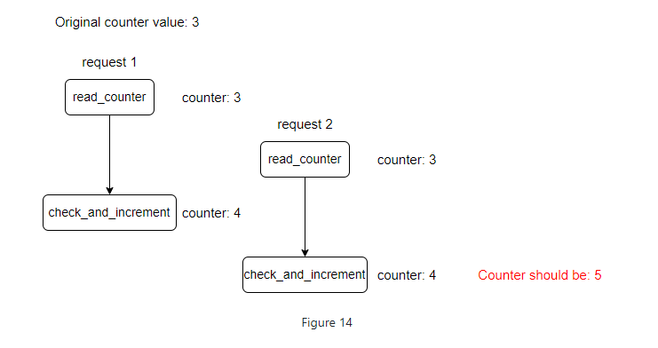

# Design A Rate Limiter

- A rate limiter is used to control the rate of traffic sent by a client or service
- For HTTP, a rate limiter limits the number of clients requests allowed to be sent over a specified period
    - If the API request count exceeds the threshold defined by the rate limiter, all the excess calls are blocked
- Some examples:
    - A user can write no more than 2 posts per second
    - You can create a maximum of 10 accounts per day from the same IP address
    - You can claim no more than 5 times per week from the same device
    
**Benefits of a Rate Limiter**

- Prevents resource starvation caused by DoS attacks
    - Almost all APIs published by large tech companies enforce some kind of rate limiting
- Reduce cost
  - Limiting excess requests means fewer servers and allocating more resources to high priority APIs
- Prevent servers from being overloaded
  - Filter on excess requests caused by bots or users' misbehavior

## Step 1 - Understand the problem and establish design scope

- Accurately limit excessive requests
- Low latency - rate limiter should not slow down HTTP response time
- Use as little memory as possible
- Distributed rate limiting
  - Rate limiter can be shared across multiple servers or processes
- Exception handling
  - Show clear exceptions to users when their requests are throttled
- High fault tolerance
  - If there are any problems with the rate limiter (i.e. cache server goes down), it does not affect entire system

## Step 2 Propose high-level design and get buy-in

### Where to put rate limiter?

- A rate limiter can either be at client-side or server-side
- Client-side implementation
  - Client is an unreliable place to enforce rate limiting because client requests can be forged by malicious actors
  - We may not have control over client implementation
- Server-side implementation


- Alternative is to have the rate limiter between the client and server
  - "rate limiter middleware"


- How does the rate limiter work here?
  - Assume our API allows to requests per second, and a client sends 3 requests to the server within a second
  - The first two requests are routed to the API servers
  - The rate limiter throttles the 3rd request and returns an HTTP status code 429


- In a microservices world, rate limiting is usually implemented within a component called `API Gateway`
- An API gateway is a managed service that supports rate limiting, SSL termination, authentication, IP whitelisting, servicing static content, etc
- When designing a rate limiter, an important question to ask ourselves is, where would the rate limiter be implemented, on the server-side or in a gateway
  - Depends on company's current technology stack, engineering resources, priorities, goals, etc
  - Some guidelines
    - Evaluate tech stack
    - Make sure current programming language is efficient to implement rate limiting on the server-side
  - Identify rate limiting algorithm that fits business needs
  - If API gateway already used, you can configure that to do rate limiting
  - Building own rate limiting service takes time
    - A commercial API gateway may be worth it

### Algorithms for rate limiting

- Most popular algorithms
  - Token bucket
  - Leaking bucket
  - Fixed window counter
  - Sliding window log
  - Sliding window counter

#### Token Bucket Algorithm

- Amazon and Stripe use this
- Token bucket algorithm
- A token bucket is a container that has a pre-defined capacity
- Tokens are put in the bucket at preset rates periodically
- Once bucket is full, no more tokens are added
- In below example, bucket capacity is 4
- Refiller puts 2 token into the bucket every second
- Once bucket is full, extra tokens will overflow


- Each request consumes one token
- When a request arrives, we check if there are enough tokens in the bucket
- If there ARE enough tokens, we take one token out for each request, and the request goes through
- If there are not enough tokens, the request is dropped


- Below figure shows how token consumption, refill, and rate limiting logic work


- Algorithm takes two parameters
  - Bucket side: max number of tokens allowed in bucket
  - Refill rate: number of tokens to put into bucket every second/minute/hour/etc
- If you need to throttle base don API endpoint, each API endpoint requires a bucket
- If you need to throttle based on IP addresses, each IP address requires a bucket
- If the system allows 10k requests per second, you need a global bucket shared by all the requests
- Pros
  - Easy to implement
  - Memory efficient
  - Token bucket allows a burst of traffic for short periods
- Cons
  - Could be challenging to tune parameters in algorithm

#### Leaking Bucket Algorithm

- Shopify uses this
- Similar to token bucket except requests are processed at a fixed rate
- Usually implemented with a FIFO queue


- Algorithm takes two parameters
  - Bucket size - this is queue size
  - Outflow rate - defines how many requests can be processed at a fixed rate, usually in seconds
- Pros
  - Memory efficient given the limited queue size
  - Requests are processed at a fixed rate therefore it is suitable for use cases that a stable outflow rate is needed
- Cons
  - Doesn't handle traffic bursts well
  - Difficulty tuning two input parameters

#### Fixed window counter algorithm

- Algorithm divides the timeline into fixed-sized time windows and assign a counter for each window
- Each request increments the counter by one
- Once the counter reaches the pre-defined threshold, new requests are dropped until a new time window starts


- Above example, time unit is 1 second, and the system allows a max of 3 requests per second
- In each second window, if more than 3 requests are received, extra requests are dropped
- Major problem with this algorithm is that a burst of traffic at the edges of time windows could cause more requests than allowed quota to go through


- Allows 10 requests to go through in a small span of time because 5 sent right before minute is up and 5 is sent right after starting a new minute
- Pros
  - Memory efficient
  - Easy to understand
  - Resetting quota at end of unit time window fits certain use cases
- Cons
  - Spike in traffic at edges could cause more requests than the allowed quote to go through

#### Sliding window log algorithm

- This algorithm fixes issue of *fixed window counter*
- Algorithm keeps track of request timestamps
  - Timestamp data kept in cache, such as sorted sets of Redis
- When new request comes in, remove all outdated timestamps
  - Outdated timestamps are defined as those older than the start of the current time window
- Add timestamp of the new request to the log
- If log size is same or smaller than the allowed count, a request is accepted - otherwise, it is rejected


- In `3`, timestamp `1:00:50` is dropped but it is still kept here
- In `4`, timestamps in range `[1:00:40, 1:01:40)` are removed from log
- Pros
  - Rate limiting is very accurate
- Cons
  - Can consume a lot of memory b/c even if request is rejected, its timestamp might still be stored in memory

#### Sliding window counter algorithm

- Hybrid approach that combines fixed window counter and sliding window low


- Rate limiter allows max of 7 requests per minute
- 5 requests in previous minute and 3 in current minute
- For a new request that arrives at a 30% position in the current window, the number of requests in the rolling window is calculated by:
  - Requests in current window + requests in previous window * overlap percentage of rolling window and preivous window
  - 3 + 5 * 0.7 = 6.5 requests
    - You can round up or down - here we will round down to 6
- So request can go through based on this
- Pros
  - Smooths out spikes in traffic
  - Memory efficient
- Cons
  - Only works for not-so-strict look back window
    - Assumes requests in previous window are evenly distributed

### High-level architecture

- We need to store counters somewhere
- Using a database is too slow
- We can use redis because it's fast and supports time-based expiration strategy
- Redis is a popular choice for rate limiting


- Client sends request to rate limiting middleware
- Middleware fetches the counter from the corresponding bucket in Redis and checks if limit is reached
- If limit reached, request rejected
- If limit not reached, request forwarded to API servers
  - System increments counter and saves it back to Redis

## Step 3: Design deep dive

### Rate limiting rules

- Configuration based set of rules
- Lyft has open-sourced version of this
- Configuration files are saved to disk

### Exceeding the rate limit

- APIs return a HTTP status code 429 to the client
- Depending on the use case, we many enqueue the rate-limited requests to be processed later

#### Rate limiter headers

- Clients know they're being throttled

```
X-Ratelimit-Remaining: The remaining number of allowed requests within the window.

X-Ratelimit-Limit: It indicates how many calls the client can make per time window.

X-Ratelimit-Retry-After: The number of seconds to wait until you can make a request again without being throttled.
```

### Detailed Design


- Rate limiting rules stored on disk
  - Workers frequently pull rules from disk and store them in cache
- When a client sends a request to the server, request is sent to rate limiter first
- Rate limit loads rules from cache
- Rate limiter decides to let request through or not
- If request limited, returns 429 to client
  - Request either dropped or forwarded to the queue

### Rate limiter in distributed environment

- Two main challenges
  - Race condition
  - Synchronization Issue

#### Race Condition

- Race conditions can happen in a highly concurrent environment



- If counter value is 3, and two requests concurrently reda the *counter* value before either of them writes the value back, each will increment the *counter* by one and write it back w/o checking the other thread
- Using a *lock* will slow down the system
- Common strategies are a *Lua script* and *sorted sets* in Redis

#### Synchronization Issue

- To support millions of users, one rate limiter might not be enough
- When multiple rate limiter servers are used, synchronization is required
- Could use sticky sessions that allow a client to send traffic to the same rate limiter
- Better solution is to use a centralize data store like Redis


### Performance Optimization

- Multi-data center setup is important because users may be located far away from the data center
- Most cloud service providers have many edge server locations around the world
- Will have to synchronize data w/ an eventual consistency data model

### Monitoring

- Gather analytics data to check whether the rate limiter is effective
- Is rate limiting algorithm effective?
- Are rate limiting rules effective?