# Design A Search Autocomplete System

- Also called typeahead
- Other design problems like this are "design top k" or "design top k most searched queries"

## Step 1 - Understand the problem and establish design scope

- Fast response time
  - Facebook autocomplete system requires 100ms
- Relevant: Autocomplete suggestions should be relevant to the search term
- Sorted: Results returned by the system must be sorted by populairty or other ranking models
- Scalable
- Highly available

## Back of the envelope estimation

- Assume 10 million daily active users (DAU)
- Average person performs 10 searches per day
- ASCII character encoding - 1 character = 1 byte
- 20 bytes of data per string
- Assume a query contains 4 words, and each word contains 5 words on average
  - 20 bytes per query
- For every character entered into the search box, a client sends a request to the backend for autocomplete suggestions
  - On average 20 requests are sent for each search query
  - For example, 6 requests are sent to backend by time you finish typing "dinner"
    - search?q=d
    - search?q=di
    - search?q=din
    - search?q=dinn
    - search?q=dinne
    - search?d=dinner
- ~24,000 query per second (QPS)
  - 10,000,000 DAU * 10 queries per day * 20 characters / 24 hours / 3600
- Peak QPS = QPS * 2 = ~48,000
- Assume 20% of the daily queries are new
  - 10 million * 10 queries per day * 20 byte per query * 20% = 40,000,000 bytes = 
  - 0.4GB of new data is added to storage daily

## Step 2- Propose high-level design and get buy in

- System is broken down into 2 parts:
  - Data gathering service
    - Gathers user input queries and aggregates them in real-time
    - Real-time processing is not practical for large data sets; however, it is a good starting point
  - Query service
    - Given a search query or prefix, return the 5 most frequently search terms

### Data gathering service

- Frequency table that stores the query string and its frequency

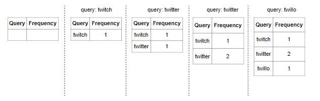

### Query Service

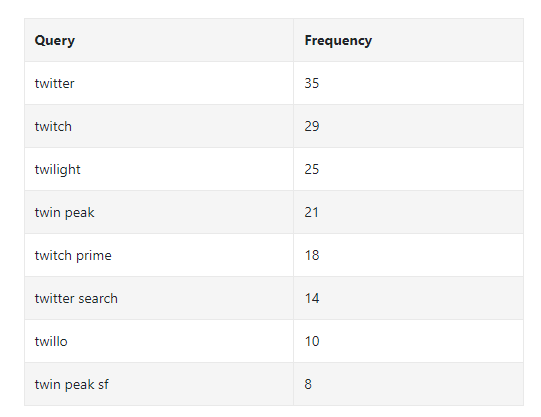

- *Query* - stores the query string
- *Frequency* - represents the number of times a query has been searched

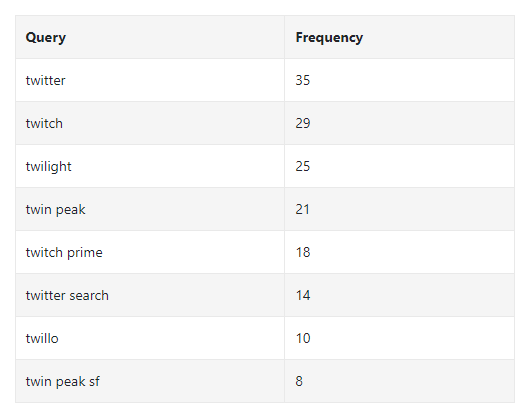

- When a user types *tw* in the search box, the following top 5 searched queries are displayed
- You can get top 5 frequently searched queries with a simple SQL query like the below

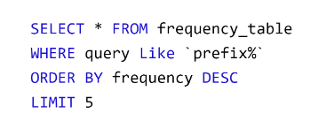

## Step 3 - Design Deep Dive

- High level design is not optimal, but serves as a good starting point

### Trie Data Structure

- Relational databases are used for storage in the high-level design
- Fetching top 5 search queries from a relational database is inefficient
- The `Trie` is used to overcome this problem

 

- A Trie is a tree-like data structure that can compactly store strings
- The name comes from the word re**trie**val
  - Designed for string retrieval operations
- Each root represents an empty string
- Each node stores a character and has 26 children
  - 1 child for each possible character
- Each tree node represents a single word or a prefix string

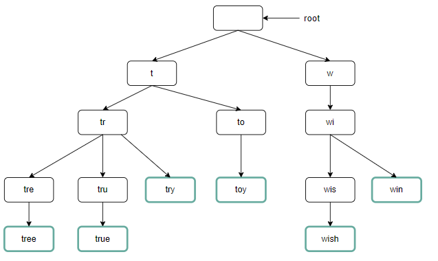

- Above figure shows a trie with search queries "tree", "try", "true", "wish", and "win"
  - Search queries are highlighted with a thicker boarder
- Basic trie data structure stores characters in nodes
- To support sorting by frequency, frequency info needs to be included in nodes

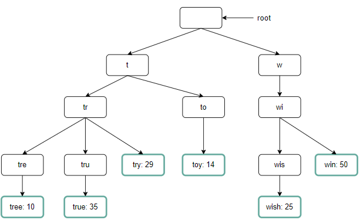

- *p* = length of prefix
- *n* = total number of nodes in a trie
- *c* number of children of a given node
- Steps to get *k* most search queries
  - Find the prefix
    - Time complexity *O(p)*
  - Traverse the subtree from the prefix node to all valid children
    - A child is *valid* if it can form a valid query string
    - Time complexity *O(c)*
  - Sort the children and get top *k*
    - Time complexity *O(clogc)*

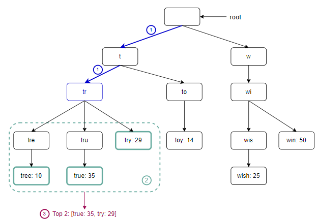

- Example of using the algorithm above the image
- Assume `k=2` and a user types `tr` in the search box
- Step 1: Find the prefix node "tr"
- Step 2: Traverse the subtree to get all valid children
  - In this case, nodes `tree: 10`, `true: 25`, and `try: 29`
- Step 3: Sort all the children and get the top 2
  - `true: 35`, and `try: 29` are the top 2 queries with prefix `tr`
- Time complexity of this algorithm is the sum of time spent on each step mentioned above `O(p) + O(c) + O(clogc)`

 

- This algorithm is straightforward, but it is too slow because we need to traverse the entire trie to get top *k* results in the worst-case scenario
- There are two optimizations that we can do
  - Limit the max length of the prefix
  - Cache top search queries at each node

#### Limit the max length of the prefix

- Users rarely type a long search query into the search box
- Safe to say *p* is a small number, say 50
- This reduces `O(p)` operation to `O(1)`

#### Cache top search queries at each node

- To avoid traversing the whole trie, we store top *k* most frequently used queries at each node
- This can significantly reduce the time complexity to retrieve top 5 queries by trading off using additional space

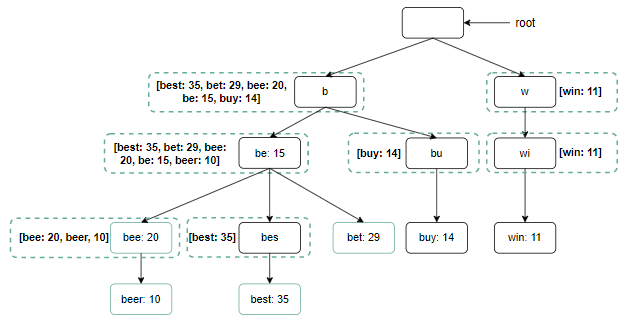

- Top 5 queries are not stored on each node
- Node with prefix `be` stores the following:
  - `[best: 35, bet: 29, bee: 20, be: 15, beer: 10]`

 

- After these additional optimizations:
  - Find prefix node time complexity is O(1)
  - Return top *k* is O(1) (because top *k* queries are cached at each node)
- As the time complexity for each of the steps is reduced to *O(1)*, our algorithm takes only *O(1)* to fetch top *k* queries

### Data Gathering System

- Currently, when a user types a search query, data is uploaded in real time
- Approach not practical for two reasons
  - Users may enter billions of queries per da
    - Updating the trie on every query significantly slows down the query service
  - Top suggestions may not change much one trie is built
    - Not necessary to update the trie frequently
- To design a scalable data gathering service, we examine where data comes from and how data is used
- Real-time applications like Twitter require up to date autocomplete suggestions
  - However, autocomplete suggestions for many Google keywords might not change much on a daily basis
- Regardless of use case, underlying foundation for data gathering service remains the same because data used to build the trie is usually from analytics or logging services

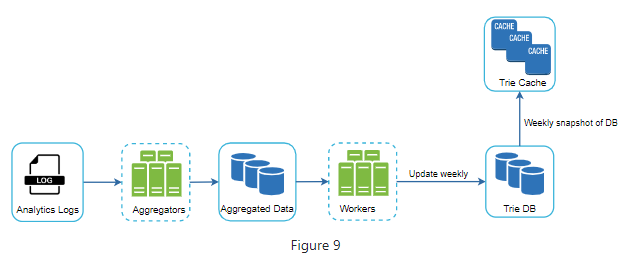

- **Analytics logs**
  - Stores raw data about search queries
  - Logs are append-only and are not indexed

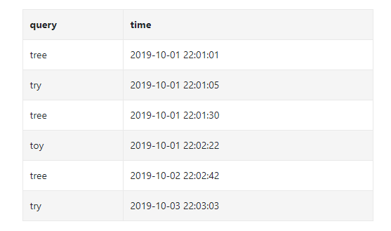

- **Aggregators**
  - Size of analytics logs is usually very large, and data is not in the right format
  - We need to aggregate data so it can be easily processed by our system
  - Depending on the use case, we may aggregate data differently
    - Twitter may require us to aggregate data in a small time interval b/c real-time results are important
    - For other use cases, we may need to aggregate only once per week

- **Aggregated Data**
  - *Time* field represents start time of a week
  - *Frequency* field is the sum of the occurrences for the corresponding query in that week

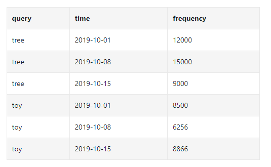

- **Workers**
  - Servers that perform async jobs at regular intervals
  - Build the trie data structure and store it in the Trie DB
- **Trie Cache**
  - Trie Cache keeps trie in memory for fast read
  - Takes the weekly snapshot of the DB
- **Trie DB**
  - Persistent storage
  - Two options
    - Document store
      - Since a new trie is built weekly, we can periodically take a snapshot of it, serialize it, and store the serialized data in the database
      - Document stores like MongoDB are good fits for serialized data
    - Key-value store
      - A trie can be represented in a hash table form
      - Every prefix in the trie is mapped to a key in a hash table
      - Data on each trie node is mapped to a value in a hash table

- Trie and hash table example

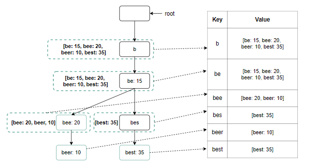

### Query Service

- In the original high-level design, the query service calls the database directly to fetch top 5 results

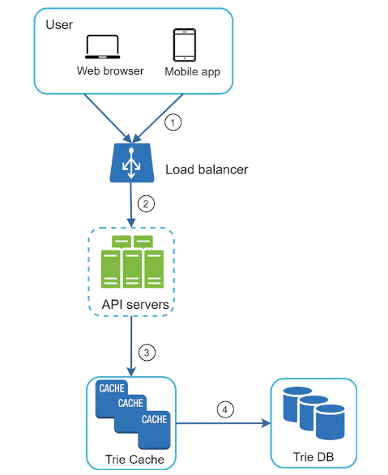

- Above is the improved design
- A search query is sent to LB
- The LB routes the request to the API servers
- API servers get from Trie Cache and construct autocomplete suggestions for the client
- If the cache data is not in the Trie Cache, we replenish data back to the cache
  - A cache miss can happen when a cache server is out of memory or offline

 

- Query service lightning fast speed
- Couple of optimizations we could make
  - Web application should send AJAX requests so that the whole web page is not refreshed
  - Browser caching
    - For many applications, autocomplete search suggestions may not change much within a short time, so many autocomplete suggestions can be saved in the browser cache to allow subsequent requests to get results from the cache directly

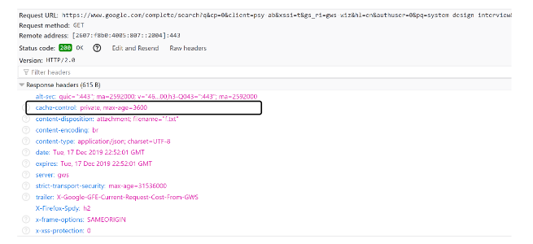 

  - Above is example from Google when searching for *system design interview*
    - Google caches results in browser for 1 hour
    - "Private" means that results are intended for single user and must not be cached by a shared cache
    - "max-age=3600" means that the cache is valid for 3600 seconds
- Data sampling:
  - For a large scale system, logging every search query requires a lot of processing power and storage
  - We could log every 1 out of *N* requests

### Trie Operations

#### Create

- Trie is created by workers using aggregated data
- Source of data is from Analytics Log/DB

#### Update

- Two ways to update
- **Option 1** - update the trie weekly
  - Once a new trie is created, the new trie replaces the old one
- **Option 2** - update individual trie node directly
  - This may be an acceptable solution for a small trie
  - This is a slow operation

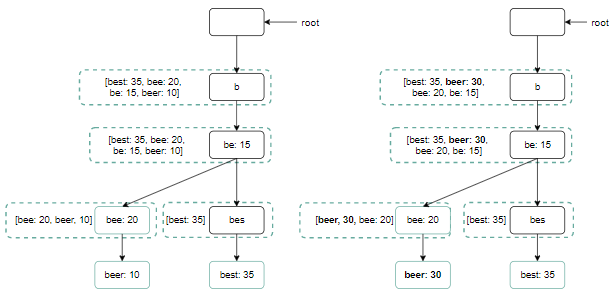

#### Delete

- We have to remove hateful, violent, dangerous, etc... autocomplete suggestions
- Can add a filter layer in front of the Trie Cache to filter out unwanted suggestions
- having a filter layer gives us the flexibility of removing results based on different filter rules

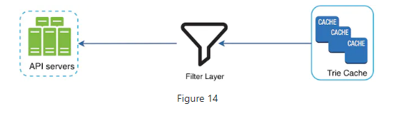

### Scale the storage

- Scalability issue when the trie grows too large to fit in one server
- We could try a naive approach of sharding based on the first character of the word
- For the English language, this would be 26 servers
- This doesn't work well because there the distribution won't be even
- To mitigate this, we can analyze historical distribution patterns and apply smarter logic sharing

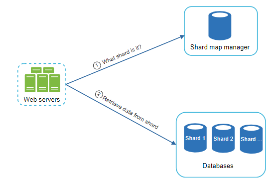

- The shard map manager maintains a lookup database for identifying where rows should be stored
  - For example, if there are a similar number of historical queries for `s` and for `u`, `v`, `w`, `x`, `y`, and `z` combined, we can maintain two shards
    - One for `s` and one for `u` to `z`