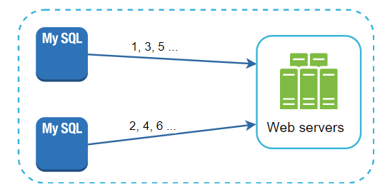
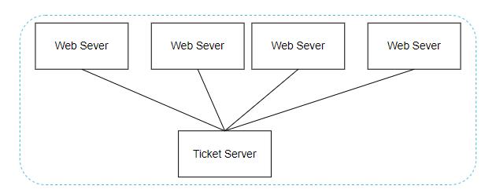
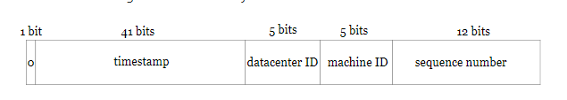

# Design a Unique ID Generator in Distributed Systems

- Can't use *auto_increment* attribute in a traditional database because a single database server is not large enough and generating unique IDs across multiple databases with minimal delay is challenging

## Step 1 - Understand the problem and establish design scope

- IDs must be unique
- IDs are numerical values only
- IDs fit into 64-bit
- IDs are ordered by date
- Ability to generate over 10,000 unique IDs per second

## Step 2 - Propose high-level design and get buy-in

- Multiple options can be considered to generate unique IDs in distributed systems
- Multi-master replication
- UUIDs (universal unique identifier)
- Ticket Server
- Twitter snowflake approach

### Multi-master replication

- First approach is multi-master replication

- This approach uses the databases' *auto_increment* feature
- Instead of increasing the next ID by 1, we increase by *k*, where *k* is the number of database servers in use
- In above figure, next ID to be generated is equal to the previous ID in the same server plus 2
- This solves some scalability issues because IDs can scale w/ number of database servers
- Some drawbacks
  - Hard to scale with multiple data centers
  - IDs do not go up with time across multiple servers
  - Does not scale well when a server is added or removed

### UUIDs

- UUID is a easy way to obtain unique IDs
- UUID is a 128-bit number used to identify information in computer systems
- Very low probability of collision
- Using this, apps can have code to generate the ID independently of each other
- Pros
  - Simple
  - Easy to scale
- Cons
  - 128 bits long, requirement is 64 bits
  - IDs do not go up with time
  - IDs could be non-numeric

### Ticket Server

- Developed by Flicker

- Idea is to use a centralized *auto_increment* feature in a single database server (a *Ticket Server*)
- Pros
  - Numeric IDs
  - Easy to implement
  - Works for small to medium-scale applications
- Cons
  - Single point of failure
    - Can add multiple ticket servers but now we face new challenges like data synchronization

### Twitter snowflake approach

- Now of the above approaches meet our requirements
- Twitter's unique ID generation system called *snowflake* can satisfy our requirements
- Instead of generating an ID directly, we divide an ID into different sections

- *Sign bit*:
  - 1 bit - for now it will always be 0
  - Reserved for future uses
  - Used to distinguish between signed and unsigned numbers
- *Timestamp*
  - 41 bits
  - Milliseconds since the epoch OR custom epoc
- *Datacenter ID*
  - 5 bits
  - Gives us `2^5` datacenters (32)
- *Machine ID*
  - 5 bits
  - Gives us `2^5` machines per data center (32)
- *Sequence number*
  - 12 bits
  - For every ID generated on that machine/processed, the sequence number is incremented by 1
  - Number is reset to 0 every millisecond

### Step 3 - Design deep dive

- We go with the snowflake approach
- Datacenter IDs and machine IDs are chosen at startup time, generally fixed once the system is running
- Any change in datacenter IDs and machine IDs require careful review since accidental change in those values can lead to ID conflicts
- Timestamp and sequence numbers are generated when the ID generator is running
- Most important 41 bits make up the timestamp section
- As timestamp grows with time, IDs are sortable by time
  - Note you can convert binary to UTC
- Max timestamp represented by 41 bits is
  - 2^41 - 1 = 2199023255551 milliseconds (ms) which gives us ~69 years
- This means that ID generator will work for 69 years and have a custom epoch time close to today's date delays the overflow time
- After 69 years, we will need a new epoch time or adopt other techniques to migrate IDs
- Sequence number is 12 bits which gives us 2^12 = 4096 combinations
- This field is 0 unless more than 1 ID is generate in a millisecond on the same server
- In theory, a machine can support a maximum of 4096 new IDs per second