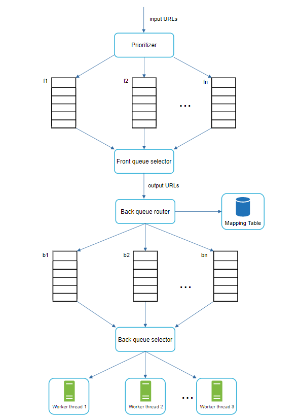

# Design a Web Crawler

- Used by search engines to discover new or updated content on the web
- Web crawler starts by collecting a few web pages and then follows links on those pages to collect new content


- Some use cases
  - Search engine indexing
  - Most common use case
- Web archiving
  - Process of collection information from the web for future uses
  - US Library of Congress does this
- Web mining
  - Used for data mining
  - Financial firms can download shareholder reports and annual reports to learn key company initiatives
- Web monitoring
  - Help to monitor copyright and trademark infringements over the internet

## Step 1 - Understand the problem and establish design scope

- Basic algorithm is simple
  1. Given a set of URLs, download all the web pages addressed by the URLs
  2. Extract URLs from these web pages
  3. Add new URLs to the list of URLs to be downloaded
     1. Repeat steps 1-3
- This problem about designing web crawler for search engine indexing
- Some other characteristics of a good web crawler
  - Scalability
  - Robustness
  - Politeness
  - Extensibility

### Back of the envelope estimation

- Assume 1 billion web pages downloaded every month
- QPS = 1,000,000,000 / 30 days / 24 hours / 3600 seconds = ~400 pages/sec
- Peak QPS = 2 * QPS = ~800 pages/sec
- Assume average web page size is 500k
- 1 billion pages x 500KB = 500TB storage per month
- Assuming data stored for 5 years, 500TB * 12 months * 5 years = 30 PB

## Step 2 - Propose high-level design and get buy-in


- High level design comes from previous studies on web crawling
- **Seed URLs**
  - Starting point for crawl process
    - For example, to crawl all web pages from a university's website, you can select seed URLs that use the university's domain name
  - To crawl the entire web, need to select good seed URLs
  - A good strategy is to divide the entire URL space into smaller ones
    - Could do it based on locality - different countries may have different popular websites
    - Could do it based on categories
      - Sports, shopping, healthcare, etc
- **URL Frontier**
  - Most web crawlers split crawl space into two
    - To be downloaded
    - Already downloaded
  - This component stores URLs to be downloaded
  - A FIFO queue
- **HTML Downloader**
  - Downloads web pages from the internet
  - URLs are provided by the URL frontier
- **DNS Resolver**
  - To download a webpage, a URL must be translated into an IP address
  - HTML downloader calls the DNS Resolver to get the IP address
- **Content Parser**
  - After a web page is downloaded, it must be parsed and validated because malformed web pages could cause problems and waste storage space
- **Content Seen?**
  - 29% of web pages have duplicate content which will cause same content to be stored multiple times
  - This component eliminates this duplication
  - Can compare two web pages by taking a hash of them
    - A slower approach would be to compare the pages character by character
- **Content Storage**
  - Extracts the links from HTML pages


- **URL Filter**
  - Excludes certain contain types, file extensions, error links, and URLs in "blacklisted" sites
- **URL Seen?**
  - Keeps track of URLs that are visited before or already in the Frontier
  - Helps to avoid adding the same URL multiple times to avoid increased server load and potential infinite loops
- **URL Storage**
  - Stores already visited URLs
- **Web Crawler Workflow**
  - Step 1: Add seed URLs to URL Frontier
  - Step 2: HTML Downloader fetches a list of URLs from URL frontier
  - Step 3: HTML Downloader gets IP addresses of URLs from DNS resolver and starts downloading
  - Step 4: Content Parser parses HTML pages and checks if the pages are malformed
  - Step 5: After content is parsed and validated, it is passed to the "Content Seen?" Component
  - Step 6: "Content" seen checks if a HTML page is already in the storage
    - If it is in the storage, this means the same content in a different URL has already been processed
      - Discarded in this case
    - If it is not in the storage, the system has not processed the content before
      - Content passed to Link Extractor
  - Step 7: Link extractor extracts links from HTML pages
  - Step 8: Extracted links are passed to the URL filter
  - Step 9: After links are filtered, they are passed to the "URL Seen?" component
  - Step 10: "URL Seen" component checks if a URL is already in the storage, if yes, it is processed before, and nothing needs to be done
  - Step 11: If a URL has not been processed before, it is added to the URL frontier


## Step 3- Design deep dive

### DFS vs BFS

- You can think of the web as a directed graph
  - web pages are nodes
  - hyperlinks (URLs) are edges
- Two main ways to traverse a graph are BFS and DFS
- BFS is the common approach used by web crawlers
- Standard BFS has two problems
  - Most web pages link back to themselves
    - This could lead to a flood of requests to wikipedia, for example
      - This is **impolite**
  - Standard BFS does not take priority of a URL into consideration
    - May want to prioritize URLs according to some ranking criteria

### URL Frontier

- Can help address above BFS problems
- Component used to ensure politeness, URL prioritization, and freshness

#### Politeness

- Web crawler should avoid sending too many requests to the same server within a period of time
  - Too many requests in a span of time is considered "impolite" or even a DoS attack
- Idea of politeness is to download one page at a time from the host
- Delay can be added between two download tasks
- The politeness constraint is implemented by maintaining a mapping from website hostnames to download (worker) threads
- Each downloader thread has a separate FIFO queue and only downloads URLs obtained from the queue


- **Queue router** - it ensures that each queue (b1, b2, ... bn) only contain URLs from the same host
- **Mapping table**: It maps each host to a queue


- **FIFO queues b1, b2, ... bn** - each queue contains URLs from the same host
- **Queue selector** - each worker thread is mapped to a FIFO queue and only downloads URLs from that queue
  - Queue selection logic is done by the Queue selector
- **Worker thread 1 to N**
  - A worker thread downloads web pages one by one from the same host
    - A delay can be added between two download tasks

#### Priority

- We can make a "Prioritizer" component that prioritizes URLs based on whatever criteria we have
  - Maybe it's based on website traffic, update frequency, etc


- **Prioritizer** - takes URLs as input and computes priorities
- **Queue f1 to fn** - each queue has assigned priority
  - Queues with higher priority are selected with higher probability
- **Queue selector** - randomly chooses a queue w/ a bias towards higher priority queues

<br>

- Once we put the Prioritizer component together with the Politness component



### Freshness

- Web pages are constantly changing
- Need to periodically recrawl downloaded pages
- Strategies
  - Recrawl based on web pages' update history
  - Prioritize URLs and recrawl important pages first and more frequently

#### Storage for URL Frontier

- Can't keep everything in memory
- Putting everything on disk is slow
- Hybrid approach
  - Keep the majority of URLs on disk
  - Keep some in memory

### HTML Downloader

- Crawlers should check a websites robots.txt and follow its rules
- Robots Exclusion Protocol (Robots.txt) is a standard used by websites to communicate with crawlers
  - Specifies what page crawlers are allowed to download

```
User-agent: Googlebot
Disallow: /creatorhub/\*
Disallow: /rss/people/\*/reviews
Disallow: /gp/pdp/rss/\*/reviews
Disallow: /gp/cdp/member-reviews/
Disallow: /gp/aw/cr/
```

#### Performance Optimization

- Below is list of performance optimizations for HTML downloader
- **Distributed Crawl**
  - Run crawl jobs on multiple server
  - URL space is partitioned into smaller pieces - each downloader is responsible for a subset of URLs


- **Cache DNS resolver**
  - DNS resolver can be slow - 10ms to 200ms response times
  - Can maintain DNS keep to keep domain name to IP address mapping and update it periodically via cron jobs
- **Locality**
  - Distribute web crawlers geographically
  - When web crawl servers are closer to website hosts, crawlers will download faster
- **Short timeout**
  - Some webservers respond slowly or may not respond at all

### Robustness

- **Consistent hashing**
  - Use to distribute load among downloaders
  - A new downloader server can be added or removed using consistent hashing
- **Save crawl states and data**
  - To guard against failures, crawl states and data are written to a storage system
  - This gives us a way to restart by loading saved states and data
- **Exception Handling**
  - Crawlers need to gracefully handler errors without crashing the system
- **Data validation**
  - Required to prevent system errors

### Extensibility

- Every system evolves and changes
- Crawler can be extended by plugging in new modules


- PNG Downloader module is plugged-in to download PNG files
- Web Monitor module is added to monitor the web and prevent copyright and trademark infringements

### Detect and avoid problematic content

- **Redundant Content**
  - Nearly 30% of web pages are duplicates
  - Hashes or check sums help to detect duplication
- **Spider traps**
  - A web page that causes an infinite loop
  - Can avoid these by setting a maximum length for a URL
  - No one-size-fits all solution to detect spider traps
- **Data noise**
  - Some content has little or no value
  - This should be excluded if possible

## Step 4 - Wrap Up

- Lot of additional potential talking points
- Server-side rendering
- Filter out unwanted pages
- Database replication and sharding
- Horizontal scaling
- Availability, consistency, and reliability
- Analytics