# Design Consistent Hashing

- To horizontally scale effectively, it is important to distribute requests/data efficiently and evenly across servers

## The rehashing problem

- If you have `n` servers, a common way to balance the load to those servers is to use the following hash method
  - `serverIndex = hash(key) % N`
    - N = size of server pool
- Example, 4 servers and 8 keys with their hashes

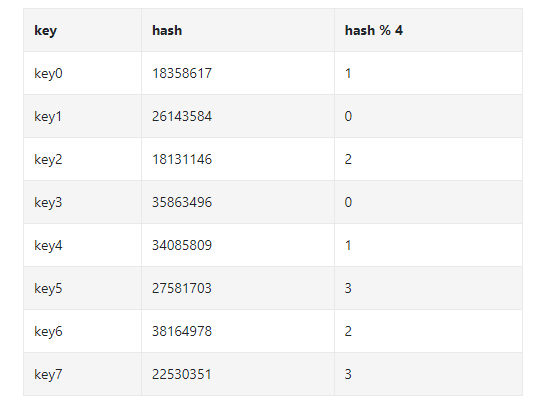

- To fetch a server where a key is stormed, we do `f(key) % 4`
  - `hash(key0) % 4 = 1`, so client must contact server 1 to fetch that data

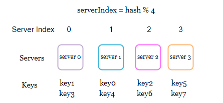

- This works well when server pool is fixed and data distribution is even
- Problems arise when new servers added, or existing servers removed
- If server pool goes offline, server pool becomes 3
- Now we end of doing `serverIndex = hash(key) % 3`

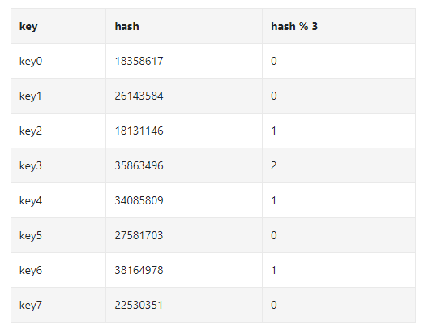

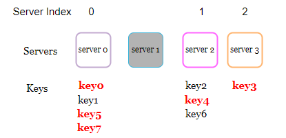

- When server 1 goes offline, most clients will be connected to the wrong servers to fetch data

## Consistent Hashing

- Special kind of hashing such that when a hash table is re-sized and consistent hashing is used, only `k/n` keys need to be remapped on average
  - *k* = number of keys
  - *n* = number of slots
- In traditional hash tables, a change in number of array slots causes nearly all keys to be remapped

### Hash space and has ring

- Assume SHA-1 is used as the hash function
  - SHA-1's hash space goes from 0 to 2^160 - 1
- If output of range is x0, x1, x2, ..., xn => x0 = 0 and xn = 2^160 - 1

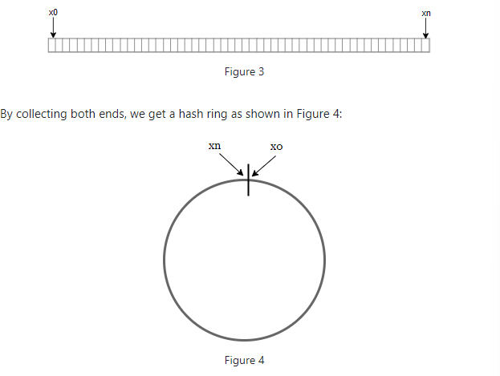

### Hash servers

- Using the same hash function f, we map servers base don server IP or server name onto the ring

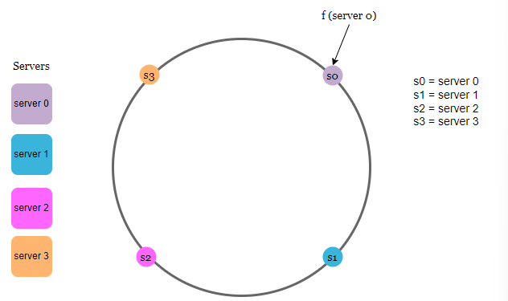

### Hash keys

- Keys (key0, key1, key2, and key3) are hashed onto the hash ring
- *NOTE: there is no modular operation now like there was in the "rehashing problem section"*

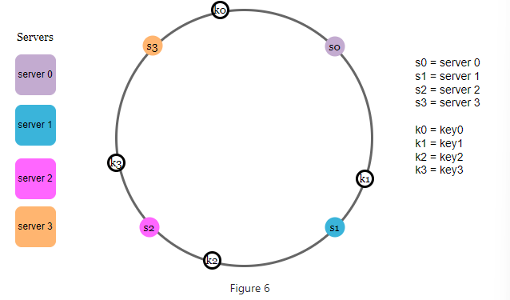

### Server lookup

- To determine which server a key is stored on, we go clockwise from the key position on the ring until a server is found

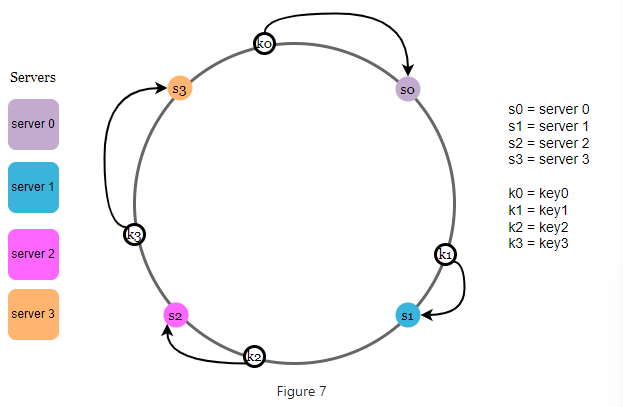

### Add a server

- Adding a new server will only require redistribution of a fraction of keys
- If a new *server 4* is added, only *key0* needs to be redistributed

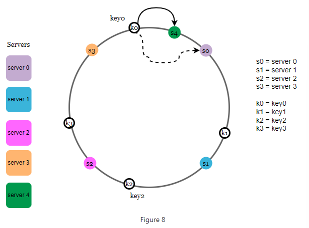

### Remove a server

- When server is removed, only a small fraction of keys require redistribution
- When *server 1* is removed, only *key 1* must be remapped to *server 2*

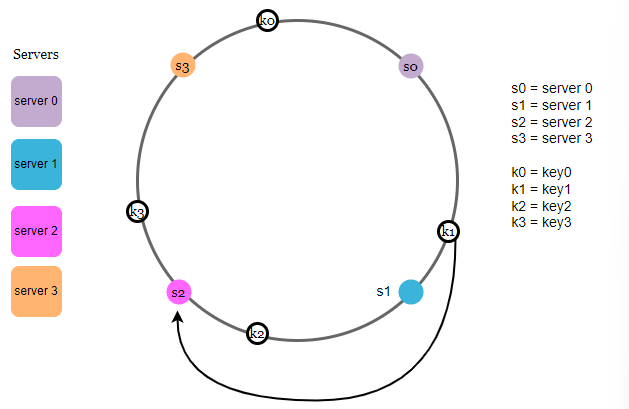

### Two issues in basic approach

- The basic steps in this are
  - Map server and keys on to the ring using a uniformly distributed hash function
  - To found out which server a key is mapped to, go clockwise until you encounter a server
- There are two problems with this approach

**Problem 1**

- Impossible to keep the same size of partitions on the ring for all servers considering a server can be added or removed
  - *A partition is the hash space between adjacent servers*
- In image below, imagine *s1* is removed, *s2*'s partition is twice as large as *s0* and *s3*'s partition

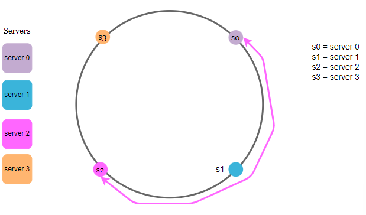

**Problem 2**

- Possible to have non-uniform key distribution on the ring
- For instance, if servers mapped to positions below, most keys are stored on *server 2* - *server 1* and *server 3* have no data

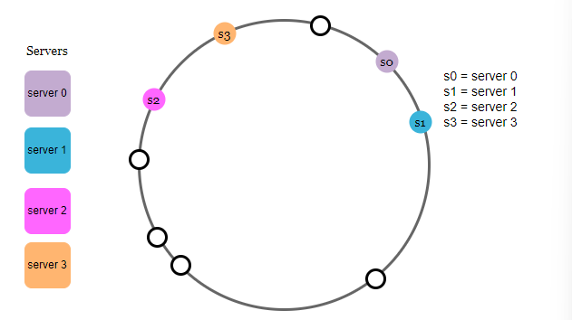

- *A technique called virtual nodes or replicas is used to solve these problems*

### Virtual Nodes

- A virtual node refers to the real node, and each server is represented by multiple vNodes in the ring
- In image below, both *server 0* and *server 1* have 3 virtual nodes
- Instead of have *s0* on the ring, we now have *s0_0*, *s0_1*, and s0_2* which represent *s0* on the ring

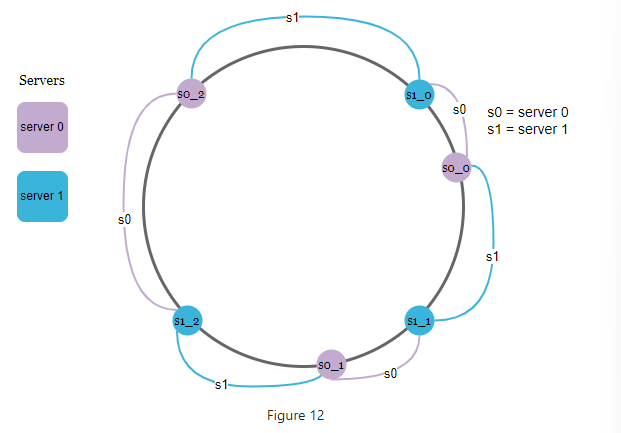

- With vNodes, each server is responsible for multiple partitions
- Partitions (the edges) with label *s0* are managed by server 0

 

- To find which server a key is stored on, we go clockwise from the key's location and find the first vNode encountered on the ring

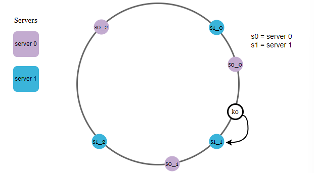

- As vNodes increase, distribution of keys becomes more balanced
- More spaces are needed to store data about vNodes as we have more vNodes

### Find affected keys

- When a server is added or removed, only a fraction of data needs to be redistributed
- In image below, *server 4* is added onto ring
- The affected range starts from *s4* and moves anticlockwise around the ring until *s3* is found
- Keys between *s3* and *s4* need to be redistributed to *s4*

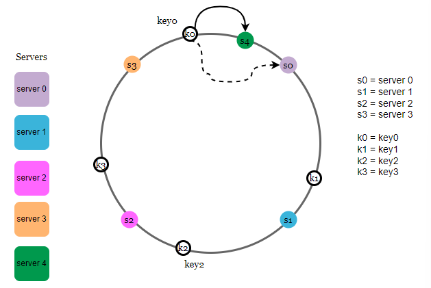

- When *s1* is removed, the affected range starts from *s1* and moves anticlockwise until *s0* is found
- Keys located between *s0* and *s1* must be redistributed to *s2*

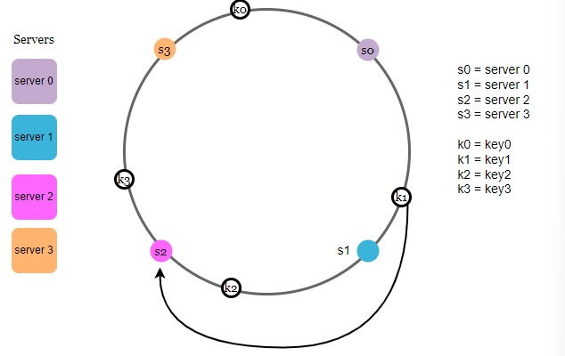

## Wrap Up

- Consistent hashing is used in real world systems such as Amazon's Dynamo DB and Apache Cassandra
- Hash function java - https://tom-e-white.com/2007/11/consistent-hashing.html