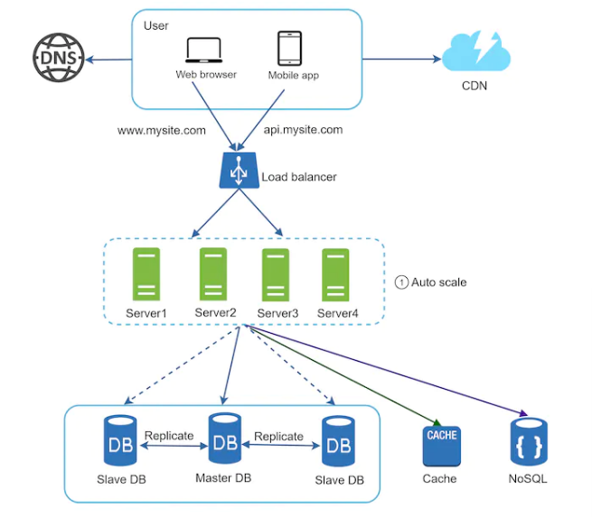

### Database Replication

- Common setup is master/slave relationship
- Master generally only supports write operations
- Slave database gets copies of the data from the master database and only supports read operations
- All data modifying commands must be sent to master
- Most applications require a much higher ratio of reads to writes

#### Advantages

- Better performance
    - Master/slave model allows more queries to be processed in parallel
- Reliability
    - If db server destroyed in natural disaster, data is still preserved
- High availability
    - Even if a db is offline, you can access data stored in another db server
    - If only one slave db is available and it goes offline, read operations will be directed to master db temporarily
      - If there is more than one slave db, read operations will be directed to remaining slave dbs
    - If master db goes offline, a slave db will be promoted to be the new master
      - May be complicated b/c newly promoted master may not be up-to-date

- Flow is
  - User gets IP address of load balancer from DNS
  - User connects to the load balancer using this IP address
  - HTTP request is routed to either server 1 or server 2
  - Web server reads data from slave db
  - Web server routes data modifying operations to master

### Cache

- See system-design.md for more info
- Used to increase performance of application
- Much faster than a db
- Common strategy is a "read-through cache"
  - Web server first checks if the cache has the available response. If it does, it sends it back to the client. If not, it queries the db, stores the data in the cache, and sends it back to the client

### CDN

- See system-design.md for more comprehensive info
- Network of geographically dispersed servers used to deliver static content
- Can serve static content like images, videos, CSS, javascript, etc
- There is also dynamic content caching (beyond scope of this course)

- There is an optional HTTP header time-to-live (TTL) that tells the CDN how long the image should be cached

- Static assets are no longer served by web servers - they are fetched from the CDN for better performance

### Stateless web tier

- State (like user session data) should not be in web tier
  - it can be in persistent storage such as a relational db or nosql
- A stateful server remembers client data (state) from one request to the next

- Image above shows session storage in a persistent store
  - NoSQL was chosen here

### Data centers

- Users are geoDNS-routed (aka geo-routed) to the closest data center
- geoDNS is a DNS service that allows domain names to be resolved to IP addresses based on the location of the user

- In the event of a significant data center outage, all traffic is directed to a healthy data center

#### Technical Challenges

- Traffic redirection
  - Tools are needed to direct traffic to the correct data center
- Data synchronization
  - Users from different regions could use different local dbs or caches
  - A common strategy is to replicate data across multiple data centers
- Test and deployment
  - Automated deployment tools are vital to keep services consistent through all the data centers

### Message Queue

- Provides async communication
- Input services called producers/publishers create messages and send them to a message queue
- Other services called consumers/subscribers connect to the queue and perform actions defined by the messages

### Logging, metrics, automation

- Logging: monitoring errors is important because it helps to identify errors and problems in the system
  - You can monitor error logs at per server level or use tools to aggregate them to a centralized service for easy search and viewing
- Metrics
  - Host level metrics - CPU, Memory, Disk I/O, etc
  - Aggregated level metrics - performance of db tier, cache tier, etc
  - Business metrics - daily active users, retention, revenue, etc
- Automation
  - When a system gets big and complex, need to build or leverage automation tools to improve productivity

### Database Scaling

#### Vertical Scaling

- Adding more resources to a db server

#### Horizontal Scaling

- Adding more db servers and sharding the data

### Summary

- Keep web tier stateless
- Build redundancy at every tier
- Cache data as much as you can
- Support multiple data centers
- Host static assets in CDN
- Scale your data tier by sharding
- Split tiers into individual services
- Monitor your system and use automation tools