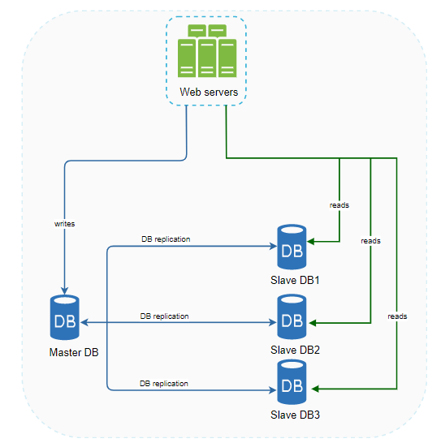
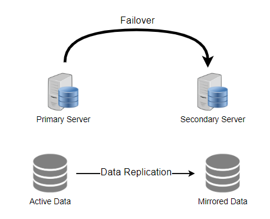

# System Design

## Step-by-Step Approach

- You need to follow a step-by-step approach to solve design problems

### Step 1: Requirements clarifications

- You should always ask questions about the exact scope of the problem we are trying to solve
- Design questions are mostly open-ended, and they don't have one correct answer
- Should clarify what parts of the system we will be focusing on
- Example: designing a Twitter-like service - example questions that should be asked
  - Will users of our service be able to post tweets and follow other people
  - Should we also design to create and display the user's timeline
  - Will tweets contain photos and videos
  - Are we focusing on the backend only or are we developing the front-end too?
  - Will users be able to search tweets?
  - Will there be any push notifications for new (or important) tweets

### Step 2: Back-of-the-envelope estimation

- It is always a good idea to estimate the scale of the system we are going to design
  - Will help later when we focus on scaling, partitioning, load balancing, and caching
- What scale is expected from the system?
  - Number of tweets
  - Number of tweet views
  - Number of timeline generations per second
- How much storage will we need? We will have different storage requirements if users can have photos and videos in their tweets
- What network bandwidth usage are we expecting
  - Crucial in deciding how we will manage traffic and balance load between servers

### Step 3: Service interface definition

- Define what APIs are expected from the system
- This will establish the exact contract expected from the system and ensure we haven't gotten any of the requirements wrong
  - Some examples for our Twitter-like service will be:
    - `postTweet(userId, tweetData, tweetLocation, userLocation, timestamp....)`
    - `generateTimeline(userId, currentTime, currentLocation, ....)`
    - `markFavoriteTweet(userId, tweetId, timestamp, ....)`

### Step 4: Defining Data Model

- Defining the data model in the early part of the interview will clarify how data will flow between different system components
- Will later help guide for data partitioning and management
- Candidate should identify various system entities, how they will interact with each other, and different aspects of data management like storage, transportation, encryption, etc
- Some entities for our Twitter-like service
  - User
    - UserId, Name, Email, DoB, CreationDate, LastLogin, etc
  - Tweet
    - TweetID, Content, TweetLocation, NumberOfLikes, Timestamp, etc
  - UserFollow
    - UserID1, UserID2
  - FavoriteTweets
    - UserID, TweetID, Timestamp
- Which db system will be use?
  - Will NoSQL like Cassandra best fit our needs, or should we use a MySQL-like solution?
  - What kind of block storage should we use to store photos and videos?

## Step 5: High-level Design

- Draw a block diagram w/ 5-6 boxes representing the core components of our system
- We should identify enough components that are needed to solve the actual problem from end to end

### Step 6: Detailed Design

- Dig deeper into two or three major components
  - Interviewer's feedback should always guide us to what parts of the system need further discussion
- Present different approaches, their pros and cons, and explain why we will prefer one approach over the other

### Step 7: Identifying and resolving bottlenecks

- Try to discuss as many bottlenecks as possible and different approaches to mitigate them

## System Design Basics

### Key Characteristics of Distributed Systems

#### Scalability

- *Scalability is the capability of a system, process, or a network to grow and manage increased demand*
- Performance of a system usually declines w/ the system size due to management or env cost
  - For example, network speed may become slower because machines tend to be far apart from one another

##### Horizontal vs. Vertical Scaling

- Horizontal scaling means that you scale by adding more servers into your pool of resources
- Vertical scaling means you scale by adding more resources (CPU, RAM, Storage, etc) to an existing server
- Good examples of horizontal scaling are Cassandra and MongoDB
  - Both provide an easy way to scale horizontally by adding more machines to meet growing needs
- Good example of vertical scaling is MySQL as it allows for an easy way to scale vertically by switching from smaller to bigger machines
  - However, this process often involves downtime

### Performance vs Scalability

- You have a performance problem if your system is slow for a single user
- You have a scalability problem if your system is fast for a single user but slow under heavy load

#### Reliability

- *Reliability is the probability that a system will fail in a given period*
- A distributed system is considered reliable if it keeps delivering its services even when one or several of its software or hardware components fail
- Any failing machine can always be replaced with another healthy one

#### Availability

- *Availability is the time a system remains operational to perform its required function in a specific period*
- Percentage of time that a system, service, or a machine remains operational under normal conditions
- Reliability is availability over time considering the full range of possible real-world conditions that can occur

#### Reliability vs Availability

- If a system is reliable, it is available
- However, the inverse is not necessarily true
- You can have high availability without high reliability
- Availability = (Actual operation time)/Scheduled operation time) * 100
- Reliability = Number of failures/Unit of time

#### Efficiency

- Let's assume we have an operation that runs in a distributed manner and delivers a set of items as a result
- Two standard measures of efficiency are: 
  - The response time (aka latency) that measures the time to obtain the first item
  - The throughput (aka bandwidth) which measures the number of items delivered in a given time unit (a second)

#### Latency (response time) vs Throughput (bandwidth)

- *Latency* is the time to perform some action to produce a result
- *Throughput* is the number of actions or results per unit of time
- You should strive for maximal throughput with acceptable latency

#### Serviceability/Manageability

- Simplicity and speed with which a system can be repaired or maintained
- Things to consider for manageability are the ease of diagnosing and understanding problems when they occur, ease of making updates, and how simple the system is to operate

### Load Balancing

- Helps to spread the traffic across a cluster of servers to improve responsiveness and availability of applications, websites, or databases
- LBs keep track of status of resources while distributing requests
  - If a server is not available to take new requests, is not responding, or has an elevated error rate, LB will stop sending traffic to that server

 

- Typically LB sits between client and server
- Accepts incoming traffic and distributes across multiple backend servers using various algorithms
- Improves application availability and responsiveness

- Can also balance load at each layer of the system

#### Benefits

- Users experience faster, uninterrupted service
- Full server failure won't impact
- Smart LB provide benefits like predictive analytics that determine traffic bottlenecks before they happen
- Sys admins experience fewer failed or stressed components

#### Load Balancing Algorithms

**How does the load balancer choose the backend server**

- Consider two factors before forwarding a request to a backend server

**Health Checks**

- LBs should only forward traffic to "healthy" servers
- LBs do a health check against servers to ensure servers are listening

##### Algorithms

- **Least Connection Method**
  - Method directs traffic to the server with the fewest active connections
  - Useful when there are a large number of persistent client connections which are unevenly distributed between the servers
- **Least Response Time Method**
  - Algorithm directs traffic to the server with the fewest active connections and lowest average response time
- **Least Bandwidth Method**
  - Method selects the server that is currently serving the least amount of traffic measured in Mbps (megabits per second)
- **Round Robin Method**
  - Cycles through a list of servers and sends each new request to the next server
  - Useful when the servers are of equal specification and there are not many persistent connections
- Weighted Round Robin Method
  - The weighted round-robin scheduling is designed to better handle servers w/ different processing capacities
  - Each server is assigned a weight
  - Servers w/ higher weights receive new connections before those with less weights
  - Servers with heigher weights get more active connections than those w/ less weights
- IP Hash
  - Under this method, a hash of the IP address of the client is calculated to redirect the request to a server

#### Redundant Load Balancers

- The LB can be a single point of failure; to overcome this, a second LB can be connected to the first to form a cluster
- Each LB monitors the health of the other

### Caching

- Caches take advantage of the fact that recently requested data is likely to be requested again
- Used in almost every computing later
- A cache is like short-term memory
  - It has a limited amount of space but is typically faster than the original data source
  - Contains the most recently accessed items

#### Application Server Cache

- Placing a cache directly on a request layer node enables the local storage of response data
- What happens though when you have many nodes behind a load balancer? This can increase the number of `cache misses`
- To overcome this there are global caches and distributed caches

#### Content Delivery (or Distribution) Network (CDN)

- Cache that comes into play for sites serving large amounts of static media
- In a typical setup, a request will first ask the CDN for a piece of static media; the CDN will serve that content if it has it available locally
  - If it isn't available, the CDN will query the back-end servers for the file, cache it locally, and serve it to the requesting user

#### Cache Invalidation

- Need to make sure that the cache is kept up to date with the source of truth
- If data is modified in the database, it should be invalidated in the cache
- This is known as `cache invaliation`
- 3 main schemes used
- **Write-through cache**
  - Data is written into cache and the corresponding db simultaneously 
  - Data consistent between cache and storage
  - Ensures nothing will get lost in case of a crash, power failure, or other system disruptions
  - Every write operation must be done twice, so this creates a higher latency for write operations

- **Write-around cache**
  - Data is written directly to permanent storage, bypassing the cache
  - Can reduce cache being flooded with write operations that are not subsequently read
  - A read request for recently written data will create a "cache miss" and must be read from slower back-end storage
- **Write-back cache**
  - Data is written to cache alone
  - Writing to permanent storage is done after specified intervals or under certain conditions
  - Risk is loss of data in case of crash because the only copy of the written data is in the cache

#### Cache Eviction Policies

- **First In First Out (FIFO)**
  - Cache evicts the first block accessed first w/o any regard to how often or how many times it was accessed before
- **Last in First Out (LIFO)**
  - Cache evicts the block accessed most recently first w/o any regard to how often or how many times it was accessed before
- **Least Recently Used (LRU)**
  - Discards the last recently used items first
- **Most Recently Used (MRU)**
  - Discards most recently used items first
- **Least Frequently Used**
  - Counts how often an item is needed, those that are used least often are discarded first
- **Random Replacement (RR)**
  - Randomly selects a candidate item and discards it to make space when necessary

### Database Replication

- Common setup is master/slave relationship
- Master generally only supports write operations
- Slave database gets copies of the data from the master database and only supports read operations
- All data modifying commands must be sent to master
- Most applications require a much higher ratio of reads to writes

#### Advantages

- Better performance
  - Master/slave model allows more queries to be processed in parallel
- Reliability
  - If db server destroyed in natural disaster, data is still preserved
- High availability
  - Even if a db is offline, you can access data stored in another db server

### Data Partitioning

#### Background

- Data partitioning is a technique to break a big database into smaller parts
- It is the process of splitting up a DB/table across multiple machines to improve manageability, performance, availability, and load balancing of an application
- After a certain pointer, it is cheaper and more feasible to scale horizontally by adding more machines

#### 1. Partitioning Methods

- Many different schemes one could use to decide how to break up an application database into multiple smaller DBs
- **Horizontal Partitioning**
  - Put different rows into different tables
    - For example, if we store different places in a table, we can decide that zip codes less than 10000 are stored in one table and places with zip codes greater than 10000 are stored in a separate table
  - *This is also called range-based partitioning as we are storing different ranges of data in separate tables*
  - **Horizontal partitioning is also known as horizontal data sharding**
  - Problem with approach:
    - If range isn't chosen carefully, then the partitioning scheme can lead to unbalanced servers
- **Vertical Partitioning**
  - We divide our data to store tables related to a specific feature in their own server
    - For example, if we are building an Instagram-like application - where we need to store data related to users, photos they upload, and people they follow - we can decide to place user profile info on one DB server, friend lists on another, etc
  - Straightforward to implement and has a low impact on the application
  - Problem with approach:
    - If our app experiences additional growth, then it may be necessary to further partition a feature specific DB across various servers
  - Also can put data on separate servers
  - **Directory-Based Partitioning**
    - A loosely coupled approach to work around issues mentioned above in the above schemes is to create a lookup service that knows your current partitioning scheme and abstracts it away from the DB access code
    - To find out where a particular data entity resides, we query the directory server that holds the mappings between key and DB server
    - This means we can add servers to DB pool or change our partitioning scheme w/o having an impact on the application
    - Problem with approach:
      - Added complexity

  #### 2. Partitioning Criteria

- *Key or Hash-based partitioning*
  - With this approach, we apply a hash function to store some key attribute(s) of the entity we are storing, this yields the *partition number*
    - For example, if we have 100DB servers and our ID is a numeric value that gets incremented by one each time a new record, the hash function could be `ID % 100` which will give us the server
  - This approach should ensure a uniform allocation of data among servers
  - Problem with approach:
    - Fixes the total number of DB servers, since adding new servers means changing the hash function which would require redistribution of data and downtime for the service
      - A workaround for this is *consistent hashing*
- **List partitioning**
  - Each partition is assigned a list of values, so whenever we want to insert a new record, we will see which partition contains our key and then we store it there
    - For example, we can decide all users living in Iceland, Norway, Sweden, Finland, or Denmark will be stored in a partition for the Nordic countries
- **Round-robin partitioning**
  - Very simple strategy that ensures uniform data distribution
  - If you have 3 nodes and 8 records
    - Record 1 goes to node 1
    - Record 2 goes to node 2
    - Record 3 goes to node 3
    - Record 4 goes to node 4
    - Etc...
- **Composite Partitioning**
  - We combine any of the above partitioning schemes to devise a new scheme
    - For example, first applying a list partitioning scheme and then a hash-based partitioning
    - Consistent hashing can be considered a composite of hash and list partitioning

#### 3. Common Problems of Data Partitioning

- On a partitioned database, there are extra constraints on teh different operations that can be performed
- Most constraints are due to the fact that operations across multiple tables or multiple rows in the same table will no longer run on the same server
- **Joins and Denormalization**
  - Performing joins on a db that is running on one server is straightforward, but once a db is partitioned and spread across multiple machines it is often not feasible to perform joins that span db partitions
  - Such joins will not be performance efficient since data has to be compiled across multiple servers
  - Common workaround for this is to denormalize the database so that queries that previously required joins can be performed in a single table
    - Downside here is the service now has to deal with the issues with denormalization, like data inconsistency
- **Referential Integrity**
  - *Referential integrity refers to the relationship between tables*
    - It is important because it ensures that all data in a db remains consistent and up-to-date
    - Helps prevent incorrect records from being added, deleted, or modified
    - Requires that a foreign key must have a matching primary key or it must be null
    - Basically means that reference from a row in one table to another table MUST be valid
  - Trying to enforce data integrity constraints such as foreign keys in a partitioned db can be extremely difficult
    - Most RBDMS do not support foreign key constraints across dbs on different db servers
      - This means applications have to enforce it in app code
      - Apps often have to run regular SQL jobs to cleanup dangling references
- **Rebalancing**
  - There could be many reasons we have to change our partitioning scheme
    - Data distribution is not uniform
    - Lot of load on a partition
  - In this situation, we have to create more DB partitions or have to rebalance existing partitions
    - Doing this w/o downtime is extremely difficult
    - Using directory-based partitioning does make rebalancing easier
      - But it increases complexity of system and creates a new point of failure

### Database Indexing

- The goal of creating an index on a particular table in a db is to make it faster to search through the table and find the row(s) we want

#### Example: A Library Catalog

- Usually in a library catalog there are two ways to look something up
  - Book Title
  - Author's name
- This way you can either think of a writer you want to read and then look up their books or look up a specific book title you know you want to read but don't know the writer's name

 

- An index is a data structure that can be perceived as a table of contents that points us to the location where actual data lives
- So when we create an index on a column of a table, we store that column and a pointer to the whole row in the index

 

- An index is a copy of selected columns of data, from a table, that is designed to enable very efficient search
- An index normally includes a "key" or a direct link to the original row of data from which it was copied, to allow the complete row to be retrieved efficiently

#### How do Indexes decrease write performance?

- We have to not only write the data to the table but we also have to update the index
- This applies to all inserts, updates, and delete operations

### Proxies

#### What is a proxy server (aka forward proxy)?

- An intermediate piece of software or hardware that sits between the client and the server
- Clients connect to a proxy to make a request for a service
- A proxy server, **aka forward proxy**, is a piece of software or hardware that facilitates the request for resources from other servers on behalf of clients
  - Anonymizing client from the server

- Typically, forward proxies are used to cache data, filter requests, log requests, or transform requests (adding/removing headers, encrypting/decrypting, or compressing a resource)
- *A forward proxy can hide the identity of the client from the server by sending requests on behalf of the client*
- Forward proxies can combine the same data access requests into one request and then return the result to the user
  - **collapsed forwarding**
  - Consider a request for the same data across several nodes, but the data is not in the cache
    - By routing these requests through the proxy, they can be consolidated into one so that we will only read data from disk once

#### Reverse Proxy

- Retrieves resources from one or more servers on behalf of the client
- These resources are then returned to the client, appearing as if they originated from the proxy server itself
- Anonymizes the server
  - Opposite of the forward proxy

- A reverse proxy, just like a forward proxy, can be used for caching, load balancing, or routing requests to appropriate servers

#### Summary

- Forward proxy hides the identity of the client
- Reverse proxy conceals identity of server
- When you want to protect your clients on your internal network, you should put them behind a forward proxy
- When you want to protect your servers, you should put them behind a reverse proxy

### Redundancy and Replication

#### Redundancy

- **Redundancy** is the duplication of critical components or functions of a system w/ the intention of increasing reliability of the system
  - Usually this comes in the form of a backup or failsafe
  - For example, you may want to create multiple copies of the file to avoid a single point of failure
- Redundancy places a key role in removing single points of failure in the system and provides backups if needed in a crisis
  - For example, if we have two instances of a server running in production and one fails, the system can fail-over to the other one

#### Replication

- **Replication** means sharing information to ensure consistency between redundant resources such as software or hardware components
- Replication is widely used in many database management systems (DBMS) usually with a primary-replica relationship between the original and the copies

### SQL vs NoSQL

- Relational databases are structured and have predefined schemas like phone books that store phone numbers and addresses
- Non-relational databases are unstructured, distributed, and have a dynamic schema like file folders that hold everything from a person's address and phone number to their Facebook likes and online shopping preferences

#### SQL

- Relational databases store data in rows and columns
- Each row contains all the information about one entity and each column contains all the separate data points

#### NoSQL

- Many common types of NoSQL databases
- **Key-Value Stores**
  - Data is stored in an array of key-value pairs
    - The `key` is an attribute name which is linked to a `value`
    - Redis, DynamoDB
- **Document Databases**
  - Data is stored in documents and these documents are grouped together in collections
  - Each doc can have an entirely different structure
  - Document databases include the CouchDB and MongoDB
- **Wide-Column Databases**
  - Instead of `tables`, in columnar databases we have column families which are containers for rows
  - Unliked relational dbs, we don't need to know all the columns up front and each row doesn't have to have the same number of columns
  - Best suited for analyzing large datasets
  - Cassandra and HBase
- **Graph Databases**
  - Used to store data whose relations are best represented in a graph
  - Data is saved in graph structures w/ nodes (entities), properties (information about the entities), and lines (connections between the entities)

#### High level differences between SQL and NoSQL

- Storage
- Schema
  - NoSQL schemas are dynamic 
  - In SQL, each record conforms to a fixed schema
- Query
  - Relational DBs use SQL
  - NoSQL databases, queries are focused on a collection of documents
    - Sometimes call UnQL (Unstructured Query Language)
    - Different DBs have different UnQL
- Scalability
  - SQL databases are vertically scalable
  - NoSQL databases are horizontally scalable
- Reliability or ACID
  - ACID = Atomicity, Consistency, Isolation, and Durability
  - Vast majority of relational DBs are ACID compliant
  - When it comes to data reliability and safe guarantees of performing transactions, SQL databases are still the better bet
  - Most of the NoSQL solutions sacrifice ACID compliance for performance and scalability

#### SQL vs NoSQL - Which one to use

- No one-size-fits-all solution
- Many solutions rely on both SQL and NoSQL databases
- Choosing the right technology depends on the use case

#### Reason to use SQL database

- Need to ensure ACID compliance
  - For many e-commerce and financial applications, and ACID-compliant database remains the preferred option
- Data is structured and unchanging
  - Business is not experiencing massive growth that would require more servers
  - If you're only working with data that is consistent, then there may be no reason to use a system designed to support a variety of data types and high traffic volumes

#### Reasons to use NoSQL databases

- NoSQL databases prevent data from being the bottleneck
- Storing large volumes of data that often have little to no structure
- Making most of cloud computing and storage
  - Using commodity hardware saves you the hassle of additional software and NoSQL databases are designed to scale across multiple data centers out of the box
- Rapid development
  - If you're making frequent updates to the data structures, relational dbs will slow you down

### CAP Theorem

#### Background

- In distributed systems, different types of failures can occur
  - Servers can crash or fail permanently, disks can go bad resulting in data losses, or network connections can be lost making a part of the system inaccessible

#### Solution

- CAP theorem states that it is **impossible** for a distributed system to simultaneously provide the following 3 properties
- **Consistency (C)**
  - All nodes see the same data at the same time
  - This means users can read or write from/to any node in the system and will receive the same data
  - Equivalent to having a single up-to-date copy of the data
- **Availability (A)**
  - Availability means every request received by a non-failing node in the system must result in a response
  - Even when severe network failures occur, every request must finish
  - Availability refers to a system's ability to remain accessible even if one or more nodes in the system go down
- **Partition Tolerance (P)**
  - A partition is a communication break (or a network failure) between any two nodes in the system
    - Both nodes could be up, but they cannot talk to each other
  - A partition-tolerant system continues to operate even if there are partitions in the system
  - Such a system can sustain any network failure that does not result in the failure of the entire network
  - Data is sufficiently replicated across combinations of nodes and networks to keep the system up through intermittent outages

 

- According to the CAP theorem, you can only pick 2 out of the three properties
- CA (Consistent - Available) is not really a option b/c a system that is not partition-tolerant will be forced to either give up Consistency or Availability in the case of a network partition
- **In the presence of a network partition, a distributed system must choose either Consistency or Availability**

- We cannot build a data store that is continually available, consistent, and tolerant to partitions because in order to be consistent, all nodes should see the same set of updates in the same order
  - But if the network loses a partition, updates in one partition might not make it to the other partitions before a client reads from the out-of-date partition
  - The only thing we can do here is to stop serving requests from the out-of-date partition, but then the service is no longer 100% available

### PACELC Theorem

#### Background

- We cannot avoid partitions in a distributed system, so a distributed system must choose between consistency and availability 
- ACID databases choose consistency
  - Response is refused if it cannot check with its peers
- BASE databases - NoSQL databases - choose availability

 

- **What happens when there is no network partition?**
  - What choices does a distributed system have when there is no partition

#### Solution

- PACELC theorem systems that in a system that replicates data:
  - If there is a partition (P), a distributed system can tradeoff between availability and consistency (A and C)
  - Else (E), when the system is running normally in the absence of partitions, the system can tradeoff between Latency (L) and Consistency (C)

- ELC is the extension

### Examples

- Dynamo and Cassandra are PA/EL systems
  - Partition Tolerant and Available - ELSE latency
- BigTable and HBase are PC/EC systems

### Consistent Hashing

#### Background

- When designing a scalable system, the most important aspect is defining how the data will be partitioned and replicated across servers
- **Data Partitioning**
  - Process of distributing data across a set of servers
- **Data Replication**
  - Process of making multiple copies of data and storing them on different servers
- Consistent Hashing efficiently solves the problem of data partitioning and replication

#### What is data partitioning?

- Act of distributing data across a set of nodes
- Two challenges
  - How do we know on which node particular piece of data will be stored
  - When we add or remove nodes, how do we know what data will be moved from existing nodes to the new nodes?
    - How can we minimize data movement when nodes join or leave
- A naive approach will use a hash function to map the data key to a number
  - Then find the server by applying modulo on this number and the total number of servers

#### Consistent Hashing to the rescue

- Distributed Systems can use Consistent Hashing to distribute data across nodes
- Consistent Hashing maps data to physical nodes and ensures that only a small set of keys move when servers are added or removed
- Consistent Hashing stores the data managed by a distributed systems in a ring
- Each node in the ring is assigned a range of data

- This solves the problem of finding a server for storing/retrieving the data
- But what happens when we add or remove a server? All of our existing mappings will be broken
  - This is because the total number of servers will be changed
  - To get things working again, we have to remap all the keys and move our data based on the new server count - a lot of work

- With consistent hashing, the ring is divided into smaller, predefined ranges
- Each node is assigned one of these ranges
- Start of the range is called a **token**
- Each node will be assigned one token
  - **Range Start**: Token value
  - **Range End**: Next token value - 1

- Whenever a system needs to read or write data, the first step it performs is to apply the MD5 hashing algorithm to the key
- Output of this hashing algorithm determines within which range the data lies which tells us which node the data will be stored

- Works great when node is added or removed, since only the next node is affected
- When a node is removed, the next node becomes responsible for all the keys stored on the outgoing node
  - **This can result in non-uniform data and load distribution**

#### Virtual Nodes

- Adding and removing nodes in any distributed system is common
- Existing nodes can die
- New nodes may be added to meet growing demands
- To handle these scenarios, Consistent Hashing makes use of virtual nodes (Vnodes)

 

- Our initial consistent hashing requires calculating tokens based on a given number of nodes
- This made adding or replacing a node an expensive operation b/c we would like to rebalance and distribute the data to all the other nodes, resulting in moving a lot of data
- Few issues associated with a manual and fixed division of ranges
  - Adding to removing nodes
    - Will result in recomputing tokens
  - Hotspots
    - If data not evenly distributed, some nodes can become hotspots
  - Node rebuilding

 

- Instead of assigning a single token to the node, the hash range is divided into multiple smaller ranges, and each physical node is assigned several of these smaller groups
- Each of these subranges is called a Vnode
- With Vnodes, a node is responsible for many tokens (or subranges)

- Vnodes are **randomly distributed** across the cluster and are generally **non-contiguous** so that no two neighboring vnodes are assigned to the same physical node
- Some servers may hold more vnodes than others

#### Advantages of Vnodes

- Help spread load more evenly across physical machines on the cluster
  - When a node is added, it receives many Vnodes from the existing nodes to maintain a balanced cluster
  - When a node is rebuilt, instead of getting data from a fixed number of replicas, many nodes participate in the rebuild process
- Make it easier to maintain a cluster containing heterogeneous machines
  - Can assign a high number of sub-ranges to a powerful server and a lower number of sub-ranges to a less powerful server
- Decreases probability of hotspots

#### Data replicating using Consistent Hashing

- To ensure high availability and durability, Consistent hashing replicates each data item on multiple N nodes in the system
  - N = replication factor
- The replication factor is the number of nodes that will receive the copy of the same data
  - A replication factor of 2 means there are two copies of each data item, and each copy is stored on a different node

 

- Each key is assigned to a **coordinator node** (generally first node that falls in the hash range) which stores the data locally and then replicates it to `N - 1` clockwise successor nodes on the ring
- This results in each node owning the region of the ring between it and its *Nth* predecessor
- In a **eventually consistent** system, this replication is done asynchronously

#### Consistent Hashing in System Design Interviews

- Consistent Hashing helps with efficiently partitioning and replicating data
- Any distributed system that wants to scale up or down to achieve high availability through data replication can utilize Consistent Hashing
- Some examples would be
  - Any system working with a set of storage (or database) servers and needs to scale up or down based on usage
    - System could need more storage during Christmas because of high traffic
  - Any distributed system that needs dynamic adjustment of its cache usage by adding or removing cache servers based on the traffic load
  - Any system that wants to replicate its data shards to achieve high availability

#### Consistent Hashing Use Cases

- Amazon's Dynamo and Apache's Cassandra use Consistent Hashing to distribute and replicate data across nodes

### Bloom Filters

#### Background

- If we have a set of structured data (identified by record IDs) stored in a set of data files, what is the most efficient way to know which file might contain our required data

#### Solution

- Use Bloom filters to quickly find if an element might be present in a set
- **The Bloom filter data structure tells whether an element may be in a set, or definitely is not**
- An empty Bloom filter is a bit-array of `m` bits, all set to 0
- There are also `k` different hash functions, each of which maps to a set element to one of the `m` bit positions
- To add an element, feed it to the hash functions to get `k` bit positions, and set the bits at these positions to 1
- To test if any element is in the set, feed it to the hash functions to get `k` bit positions
  - If any of the bits at these positions is 0, the element is **definitely not** in the set
  - If all are 1, then the element **may be** in the set

 

- Example below of a Bloom filter with 3 elements, `P`, `Q`, and `R`
- It consists of 20 bits and uses 3 hash functions
- Colored arrows point to the bits that the elements of the set are mapped to

- The element `x` is definitely not in the set, since it hashes to a bit position containing 0
- Adding a new element and testing for membership are both constant time operations, and a filter with room for `n` elements requires O(n) space

#### Java Example

- Why not just use something like a hash table, hash map, or hash set
  - These do not work well for large data sets
  - Insertion time slows dramatically and jvm head usage grows dramatically
- https://www.geeksforgeeks.org/bloom-filter-in-java-with-examples/

### Quorum

#### Background

- In Distributed systems, data is replicated across multiple servers for fault tolerance and high availability
- One a system decides to maintain multiple copies of data, how do we make sure that all the replicas are consistent?
  - How can we make sure that all the replicas have the latest copy of data and that all clients see the same view of the data

#### Solution

- A **quorum** is the minimum number of servers on which a distributed operation needs to be performed successfully before declaring the operation's overall success
  - Quorum refers to the minimum number of machines that perform the same action (commit or abort) for a given transaction in order to decide the final operation for that transaction

 

- Suppose a database is replicated on 5 machines
- In a set of 5 machines, 3 machines the majority quorum, and if they agree, we will commit the operation
- Quorum enforces the consistency requirement needed for distributed operations

 

- In a system with multiple replicas, there is a possibility that the user reads inconsistent data
- For example, when there are 3 read replicas, `R1`, `R2`, and `R3` in a cluster, and a user writes value `v1` to replica `R1`
  - If another user then reads from either replica `R2` or `R3` which are still behind `R1` and thus will not have the value `v1`
    - In this case, this other user will not get the consistent state of data

 

- **What value should we choose for a quorum**
  - More than half of the number of nodes in the cluster
    - (N/2 + 1) where N is the total number of nodes in the cluster
    - In a 5-node cluster, 3 nodes must be online to have a majority
    - In a 4-node cluster, 3 nodes must be online to have a majority
    - *With a 5-node cluster, the system can afford two node failures, but with a 4-node cluster, it can only afford a one node failure. Because of this logic, it is recommended to always have an odd number of total numbers in the cluster*

 

- Quorum is achieved when nodes follow the below protocol:
  - R + W > N, where:
    - N = nodes in the quorum group
    - W = minimum write nodes
    - R = minimum read nodes

 

- If a distributed system follows `R + W > N`, then every read will see at least one copy of the latest value written
- For example, a common configuration could be `N = 3`, `W = 2`, and `R = 2`to ensure strong consistency
- Some other common configurations
  - `N = 3`, `W = 1`, `R = 3`
    - fast write
    - slow read
    - not very durable
  - `N = 3`, `W = 3`, and `R = 1`
    - Slow write
    - Fast read
    - Durable

 

- Keep these 2 things in mind before deciding read/write quorum
  - `R = 1` and `W = N` == full replication (write-all, read-one)
    - Undesirable when servers can be unavailable because writes are not guaranteed to complete
  - `1 < r < w < n`
    - Best performance (throughput/availability) b/c reads are more frequent than writes in most applications

### Leader and Follower

#### Background

- Distributed systems keep multiple copies of data for fault tolerance and higher availability
- A system can use quorum to ensure data consistency between replicas
- A quorum can lead to lower availability 
  - The system needs to ensure that at least a majority of replicas are up and available, otherwise the operation will fail
- A quorum, in certain failure scenarios, can still cause the client to see inconsistent data

#### Solution

- Allow a single server - called *leader* - to be responsible for data replication and to coordinate work
- At any time, one server is elected as the leader
- This leader becomes responsible for data replication and can act as the central point for all communication
- The *followers* only accept writes from the leader and serve as a backup
- In the case the leader fails, one of the followers can become the leader
- In some cases, the follower can serve read requests for load balancing

### Heartbeat

#### Background

- To efficiently route requests in a distributed environment, servers need to know what other servers are part of the system
- Servers should know if other servers are alive and working
- In a decentralized system, whenever a request arrives at a server, the server should have enough information to decide which server is responsible for entertaining that request
- Timely detection of a server failure becomes an important task- this also enables the system to take corrective actions and move the data/work to another healthy server

#### Solution

- Each system periodically sends a heartbeat message to a central monitoring server or other servers in the system to show that it is still alive and functioning
- Heartbeating is one of the mechanisms for detecting failures in a distributed system
- If there is a central server, all servers periodically send a heartbeat message to it
- If there is no central server, all servers randomly choose a set of servers and send them a heartbeat message every few seconds
- If there is no heartbeat within a configured timeout period, the system can conclude that the server is not alive anymore and stop sending requests to it and start working on its replacement

### Checksum

#### Background

- How can a distributed system ensure data integrity, so that a client receives an error instead of corrupt data
- In a distributed system, moving data between components, it is possible that the data fetched from a node may arrive corrupted

#### Solution

- Calculate a checksum and store it with data
- You can use a hash function like MD5, SHA-1, SHA-256, SHA-512, etc
- The hash function takes the input data and produces a string of fixed length
  - This is called the **checksum**

 

- When a system is storing some data, it computes a checksum of the data and stores the checksum with the data
- When a client retrieves data, it verifies that the data it received from the server matches the checksum stored
- If not, the client can opt to retrieve that data from another replica